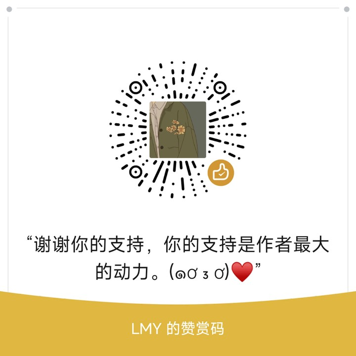

# <p align="center">Auto-PPT</p>

#### <p align="center"><i>Empowering PPT Creation with GPT</i></p>

<p align="center">
<br> <a href="Readme.md">中文</a> | English
</p>

<p align="center">
<a href="https://github.com/limaoyi1/Auto_PPT/stargazers" target="blank">

</a>
<a href="https://github.com/limaoyi1/Auto_PPT/fork" target="blank">

</a>
<a href="https://github.com/limaoyi1/Auto_PPT/pulls" target="blank">

</a>
<a href='https://github.com/limaoyi1/Auto_PPT/blob/main/LICENSE'>

</a>
<a href='https://github.com/limaoyi1/Auto_PPT/releases'>

</a>
</p>


[//]: # (https://github.com/ikatyang/emoji-cheat-sheet Emoji Repository)

## 🎞️ Project Introduction

&nbsp;&nbsp;&nbsp;&nbsp;A completely open source, free project that generates PPTs through various GPT models
Front end pages with online PPT editing capabilities and backend services compatible with multiple models and languages
## 💥 Important Updates

> 2023/8/18 | v3.0 Almost Completed Project Refactoring
> - Refactored backend services, removed the use of Redis, switched to SQLite3, and eliminated the dependency on python-pptx.
> - Refactored frontend services, supporting Markdown editing, Markdown browsing, and PPT operations.
> - Created an open-source component for online editing of Markdown to PPT.
> - Added support for GPT3.5, GPT4, and Baidu Wenxin Yiyu.
> - Optimized the generation effects and quality of outlines and full text, enhanced the use of LangChain.
> - Fully supports both English and Chinese.

## ⭐ Thank You for Your Support

> By starring the project, you show your recognition and help us gain more attention in the community.\
> This motivates us to continuously improve and develop new features, enhancing your experience with Auto_PPT.\
> 
> Main Contributors:
- v3.0 Backend [limaoyi](https://github.com/limaoyi1)
- v3.0 Frontend [liumengniu](https://github.com/liumengniu)

> Special thanks to [Miraitowa-wsy](https://github.com/Miraitowa-wsy) for their sponsorship.

## 🤝 Communication

### WeChat Group
<details>
  <summary>WeChat Group QR Code, valid until February 25</summary>

  
</details>

### Author's WeChat
<details>
  <summary>Author's WeChat QR Code</summary>

  
</details>

### Buy Me Coffee?
<details>
  <summary>Author's WeChat Pay QR Code</summary>

  
</details>

## 🛸 Usage Instructions

### Online Usage

> New version trial link 🔗 : [Trial Link](http://www.limaoyi.top:4399/#) In just 2-3 minutes, you can have a professionally designed PPT.

### Local Deployment

#### Windows Software Packaging
> Not available at the moment.

#### Windows
##### 1. Open cmd or another terminal, clone the project locally
```bash
git clone https://github.com/limaoyi1/Auto-PPT.git
```
##### 2. Checkout the main branch
```bash
git checkout main 
```
##### 3. Create and activate a virtual environment
```bash
python -m venv myenv
cd .\myenv\Scripts
activate
cd ../../
```
##### Add your API keys in /auto_ppt/config.ini
[config.ini](./auto_ppt/config.ini)

##### 4. Auto-PPT, start!
```bash
python application.py
```
##### Access the local webpage
[localhost:5000](http://localhost:5000/)

#### Linux
> Similar steps apply, but I recommend using Nginx for serving static pages separately.

## 🌟 Star History

[](https://star-history.com/#limaoyi1/Auto_PPT&Timeline)

## 💡 Next Version

> 2023/7/3 | v0.5.1 | Birth of an Idea | Completed ✔️
>

| Blueprint | Issues              | Completion |
|:---------:|---------------------|:----------:|
| Deploy Online Service | UI too basic       | Completed |
| Optimize Content Generation | Content not detailed and accurate enough | Deferred to next version |
| Optimize Generation Steps | Difficult to create high-quality PPT in a single step | Completed on 7/14 |
| Optimize Project with langChain | Optimize as chain calls | Completed on 7/14 |

> 2023/7/6 | v1.0 | Refactor Code with langChain | Completed ✔
>

| Blueprint | Issues | Completion |
|:---------:|--------|:----------:|
| Optimize Content Generation | Content not detailed and accurate enough | Deferred to next version |
| Optimize Generation Steps | Difficult to create high-quality PPT in a single step | Completed on 7/14 |
| Optimize Project with langChain | Optimize as chain calls | Completed on 7/14 |

> 2023/7/15 | v1.5 | Further Optimize python-pptx | Completed ✔
>

| Blueprint | Issues | Completion |
|:---------:|--------|:----------:|
| Compatible with More md Formats | High workload formd formats | Frontend supports md display and PPT conversion |
| Refactor Frontend Code in a Language | Not familiar with frontend as a backend engineer | Completed ✔ |
| Optimize Theme Effects | Lack of aesthetic PPT templates for reference | Deferred to next version |
| Optimize Deployment | Forking process not user-friendly | Completed ✔ |

> 2023/8/18 | v3.0 Almost Completed Project Refactoring | Completed ✔
>

| Blueprint | Optimization | Completion |
|:---------:|--------------|:----------:|
| Refactor Backend Services | Removed Redis usage, switched to SQLite3, eliminated python-pptx dependency | Completed ✔ |
| Refactor Frontend Services | Supports Markdown editing, browsing, and PPT operations in frontend | Completed ✔ |
| Create Open Source Component for Online Markdown to PPT Conversion | | Completed ✔ |
| Support GPT3.5, GPT4, Baidu Wenxin Yiyu | | Completed ✔ |
| Optimize Outline and Full Text Generation Effects and Quality | Enhanced LangChain usage | Completed ✔ |
| Fully Support English and Chinese | | Completed ✔ |