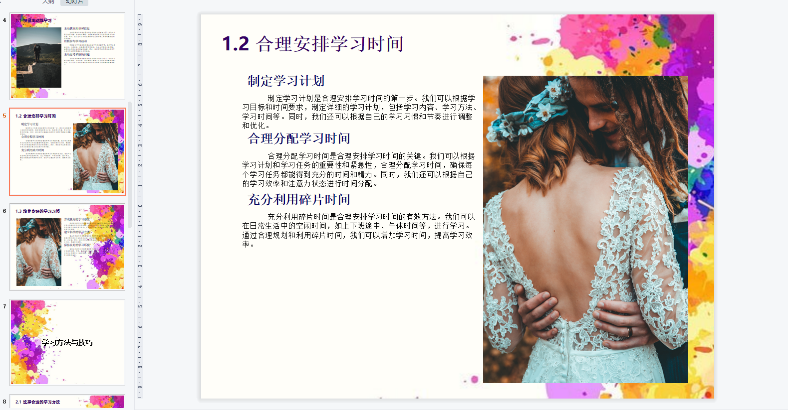

# <p align="center">Auto_PPT: Generate Your PPT Automatically</p>

<p align="center"><i>Tired of spending endless hours creating dull presentations? Wishing for a magical tool that can generate stunning PPTs for you in seconds? Well, fret no more! Introducing Auto_PPT!</i></p>

<p align="center">
<a href="https://github.com/limaoyi1/Auto_PPT/fork" target="blank">

</a>

<a href="https://github.com/limaoyi1/Auto_PPT/stargazers" target="blank">

</a>
<a href="https://github.com/limaoyi1/Auto_PPT/pulls" target="blank">

</a>
<a href='https://github.com/limaoyi1/Auto_PPT/blob/main/LICENSE'>

</a>
<a href='https://github.com/limaoyi1/Auto_PPT/releases'>

</a>
</p>


[//]: # (https://github.com/ikatyang/emoji-cheat-sheet 表情仓库)

## 🔥 [中文指南](./Readme.md)

> 中文用户请移步 [中文指南](./Readme.md).

## 🎞️ Project Introduction 

> Utilizing gpt-3.5-turbo and pptx, Auto_PPT effortlessly generates PPTX files with specified themes. \
> 
> Below is an unmodified example generated by the project:
> 

## ⭐ Thanks for Your Support

> By starring the project, you demonstrate your recognition and help us gain more attention in the community. \
> This motivates us to continuously improve and develop new features to enhance your experience with Auto_PPT.

> "Special thanks to [Miraitowa-wsy](https://github.com/Miraitowa-wsy) for their sponsorship."
## 🛸 Free Trial

> New Version Trial Link 🔗: [Trial Link](http://www.limaoyi.top:4399/#)

> 🧭 Get a professionally designed PPT in just 2-3 minutes. The generation time depends on the speed of the OpenAI interface, ensuring efficient and reliable operation.

> 🔗 Try it now, let's explore the magic of Auto_PPT together! Please note that, to maintain limited server traffic, we do not currently provide random image services.

## 🧲 Project Advantages

> 🌟 No more hassle: Simply enter the title, and Auto_PPT will instantly create a brand new PPTX for you without any extra effort!

> 🎩 The magic behind: We leverage the powerful gpt-3.5-turbo-16k interface to ensure stable and impressive PPT outlines with every generation.

> 💡 Creative use of md format: We uniquely utilize the md format in a multi-step chain to generate PPT text, making PPTX creation easier and more stable. Say goodbye to formatting hassles and focus on content creation!

> 🔗 Optimized and refactored using langChain in v1.0: Thanks to langChain, the code becomes simple, easy, and aesthetically pleasing!

> 🖼️ Scenic illustrations: We collaborate with Unsplash to provide the most exquisite illustrations, instantly adding vitality and aesthetics to your PPT.

> 🔒 Secure local deployment: If you're concerned about data security, fret not! Auto_PPT supports local deployment; simply add your OpenAI API key and Unsplash API key information.

## 🎨  Deployment Guide
>The project operation requires a Python environment, and it is recommended to use Python 3 or above. The author uses Python 3.9
>1 Creating a virtual environment
```Bash
python - m venv venv
```
>2 Activate virtual environment
```Bash
. venv/bin/activate
```
>3 Install required Python components
```Bash
pip install - r requirements. txt
```
>4 Add your API key in config.ini
>5 Modify/ The base absolute path of readconfig/mycofig.py makes it the folder path of config.ini
>6 Run Project
>Run
```Bash
python application.py
```
>Alternatively (in production mode), the following commands need to be run in a Linux like environment
```Bash
gunicorn - b 0.0.0.0:5000-- log level=debug -- threads 4 app: application>gunicorn. log 2>&1&
```
>7 Access http://127.0.0.1:5000

## 💡 Next Version

> 2023/7/3 | v0.5.1 | Birth of an idea | Completed ✔️
>

| Blueprint                  | Existing Issues             | Completion                 |
|----------------------------|-----------------------------|----------------------------|
| Deploy Online Service      | UI is too rudimentary       | Completed                  |
| Optimize Generation Format | Format is too monotonous    | Adjusted paragraph spacing |
| Optimize Generation Speed  | OpenAI API response is slow | Optimized service startup  |

> 2023/7/6 | v1.0 | Refactor with langChain | Completed ✔
>

| Blueprint                             | Existing Issues                                    | Completion                   |
|---------------------------------------|----------------------------------------------------|------------------------------|
| Optimize Generation Content           | Generated content not detailed and accurate enough | Deferred to the next version |
| Optimize Generation Steps             | Single step is not enough for a high-quality PPT   | Completed on 7/14            |
| Use langChain to optimize the project | Refactor into a chain call                         | Completed on 7/14            |

> 2023/7/15 | v1.5 | Next version tasks | In progress 🧭
> 
| Blueprint                                         | Existing Issues                                          | Completion   |
|---------------------------------------------------|----------------------------------------------------------|--------------|
| Support more md formats                           | Large amount of work for md formats                      | Just started |
| Refactor front-end code using a specific language | Lack of familiarity with front-end for backend engineers | Completed ✔  |
| Optimize theme effects                            | Lack of aesthetic ppt template reference                 | Just started |

## 🌟 Star History

<br>

[](https://star-history.com/#limaoyi1/Auto_PPT&Timeline)

</br>

## 🔗 Communication & Sponsorship & Custom Development

<details>
  <summary>WeChat</summary>

  
</details>

[Author's Blog](http://www.limaoyi.top/)