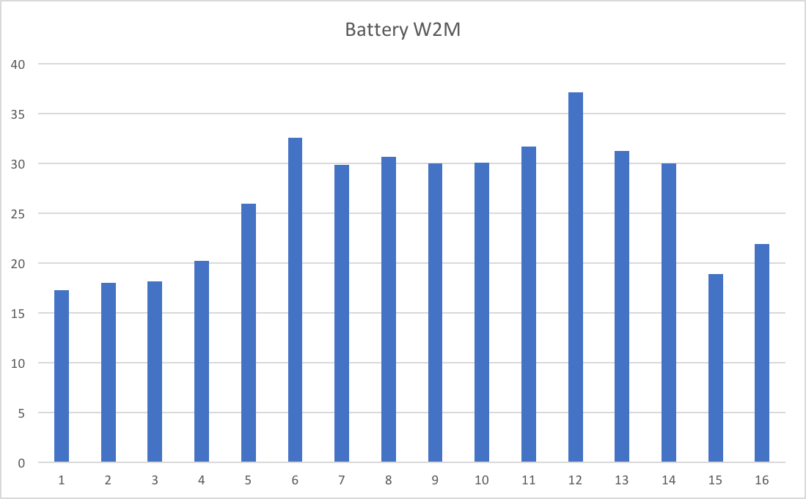

master: Martin Master.pptx
pageTitleSize: 30
sectionTitleSize: 48
sectionSubtitleSize: 32
numbers: no
abstractTitle: Abstract

# Even More Fun With DDF
Martin Packer 🦕 , IBM

### Abstract

* The idea of "alien" DB2 work coming into your system through DDF strikes fear into even the most seasoned Performance Specialist...

* How will I classify it?

* What will stop it from taking over my machine?

* This presentation describes how to use performance data to address both of those questions, based on the author's recent experiences with numerous customers.

* It also enables you to understand what applications and machines are issuing the DDF requests, improving your knowledge of the application landscape.

* This presentation has substantially evolved in 2017.

### Class 1 CPU From Two Batteries Of 16 Websphere Application Servers Not balanced within each battery or between batteries

|||

