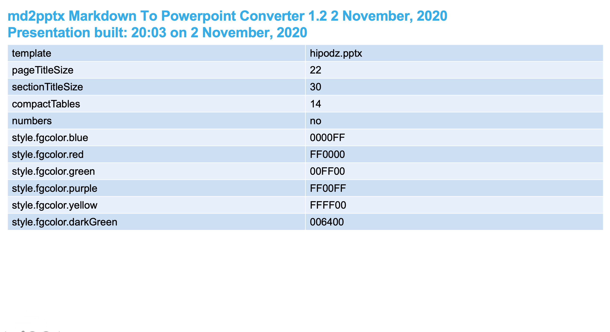
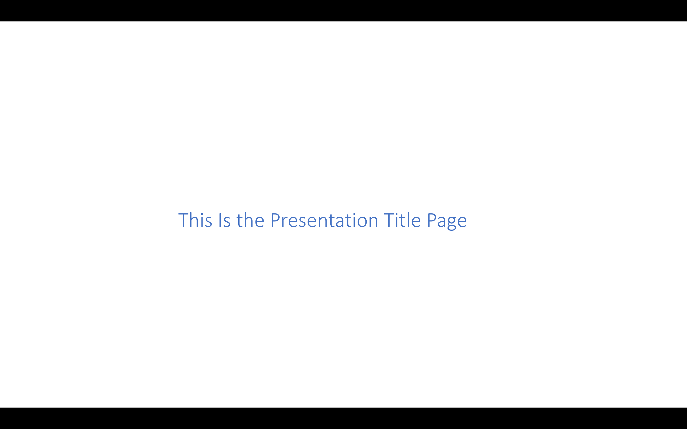
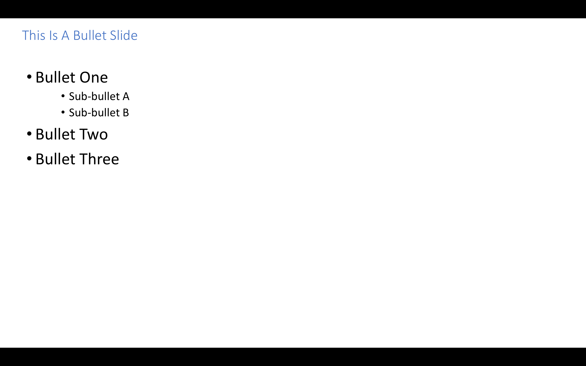
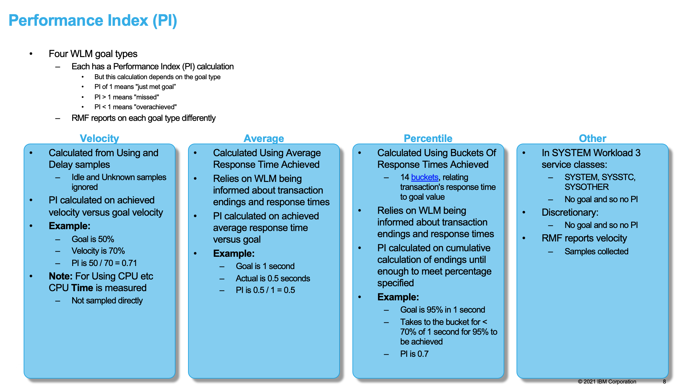
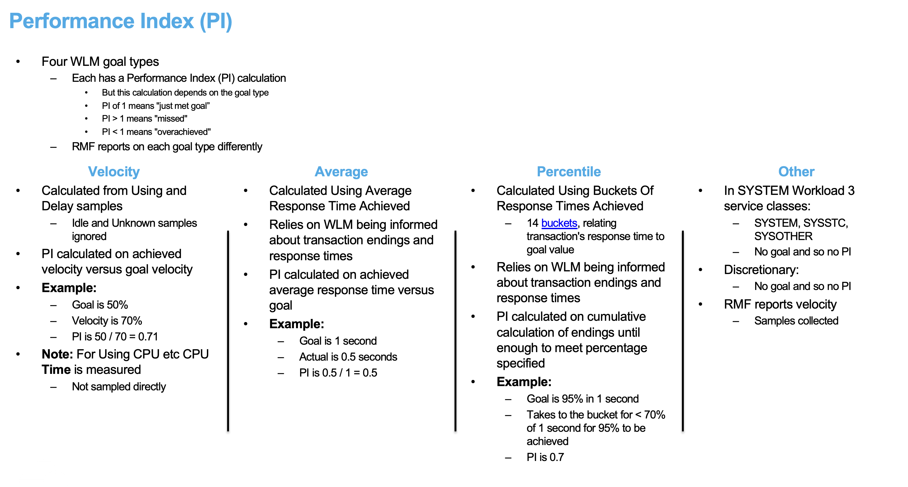

# Markdown To Powerpoint User Guide

This document describes the md2pptx Markdown preprocessor, which turns Markdown text into a Powerpoint presentation (whether .pptx or [.pptm](#invoking-a-vba-macro)).

In this document we'll refer to it as "md2pptx", pronounced "em dee to pee pee tee ex".

As you can see in the [change log](#change-log), md2pptx is frequently updated - both for bug fixes and enhancements.

### Table Of Contents

* [Why md2pptx?](#why-md2pptx)
	* [A Real World Use Case](#a-real-world-use-case)
	* [Using md2pptx With mdpre](#using-md2pptx-with-mdpre)
* [How Do You Use md2pptx?](#how-do-you-use-md2pptx)
	* [Installation](#installation)
	* [Use](#use)
* [python-pptx license](#pythonpptx-license)
* [Change Log](#change-log)
* [Creating Slides](#creating-slides)
	* [Presentation Title Slides](#presentation-title-slides)
	* [Presentation Section Slides](#presentation-section-slides)
	* [Bullet Slides](#bullet-slides)
		* [Numbered List Items](#numbered-list-items)
	* [Graphics, Video And Audio slides](#graphics-video-and-audio-slides)
		* [Graphics Slides](#graphics-slides)
			* [Clickable Pictures](#clickable-pictures)
			* [Graphics File References](#graphics-file-references)
		* [Video And Audio Slides](#video-and-audio-slides)
			* [Video Slides](#video-slides)
			* [Audio Slides](#audio-slides)
	* [Table Slides](#table-slides)
		* [Special Case: Two Graphics Side By Side](#special-case-two-graphics-side-by-side)
		* [Special Case: Two By Two Grid Of Graphics](#special-case-two-by-two-grid-of-graphics)
		* [Special Case: Three Graphics On A Slide](#special-case-three-graphics-on-a-slide)
		* [Special Case: One Graphic Above Another](#special-case-one-graphic-above-another)
		* [Multi-Column Table Cells](#multicolumn-table-cells)
	* [Card Slides](#card-slides)
	* [Code Slides](#code-slides)
		* [`<code>`](#<code>)
		* [Triple Backticks (```)](#triple-backticks-())
			* [Special Processing Of Code Within Triple Backticks](#special-processing-of-code-within-triple-backticks)
				* [GraphViz](#graphviz)
		* [Indented Text](#indented-text)
		* [`<pre>`](#<pre>)
	* [Funnels](#funnels)
	* [Task List Slides](#task-list-slides)
	* [Slides With More Than One Content Block](#slides-with-more-than-one-content-block)
	* [Adding Slide Notes](#adding-slide-notes)
* [Slides Without Titles](#slides-without-titles)
	* [Using A Horizontal Rule](#using-a-horizontal-rule)
	* [Using A Level 3 Heading With `&nbsp;`](#using-a-level-3-heading-with-&nbsp;)
* [Hyperlinks And VBA Macros](#hyperlinks-and-vba-macros)
	* [Coding A URL Reference](#coding-a-url-reference)
	* [Coding A Heading Reference On A Target Slide](#coding-a-heading-reference-on-a-target-slide)
	* [Coding A Hyperlink To Another Slide](#coding-a-hyperlink-to-another-slide)
	* [Invoking A VBA  Macro](#invoking-a-vba-macro)
		* [Sample Macro To Remove The First Slide](#sample-macro-to-remove-the-first-slide)
		* [Sample Macro To Remove The First Slide And Save As A .pptx File](#sample-macro-to-remove-the-first-slide-and-save-as-a-pptx-file)
* [HTML Comments](#html-comments)
* [Special Text Formatting](#special-text-formatting)
	* [Using HTML `<span>` Elements To Specify Text Colours And Underlining](#using-html-<span>-elements-to-specify-text-colours-and-underlining)
		* [Using HTML `<span>` Elements with `class`](#using-html-<span>-elements-with-class)
		* [Using HTML `<span>` Elements with `style`](#using-html-<span>-elements-with-style)
	* [HTML Entity References](#html-entity-references)
	* [Numeric Character References](#numeric-character-references)
	* [Escaped Characters](#escaped-characters)
	* [CriticMarkup](#criticmarkup)
* [Creating A Glossary Of Terms](#creating-a-glossary-of-terms)
* [Creating Footnotes](#creating-footnotes)
	* [Creating A Footnote](#creating-a-footnote)
	* [Referring To A Footnote](#referring-to-a-footnote)
* [Controlling The Presentation With Metadata](#controlling-the-presentation-with-metadata)
	* [Specifying Metadata](#specifying-metadata)
		* [Processing Summary](#processing-summary)
		* [Specifying Colours](#specifying-colours)
			* [Theme Colours](#theme-colours)
			* [RGB Colours](#rgb-colours)
	* [Metadata Keys](#metadata-keys)
		* [Title And Subtitle Font Sizes And Alignment](#title-and-subtitle-font-sizes-and-alignment)
			* [Page Title Size - `pageTitleSize`](#page-title-size-pagetitlesize)
			* [Page Subtitle Size - `pageSubtitleSize`](#page-subtitle-size-pagesubtitlesize)
			* [Section Title Size - `sectionTitleSize`](#section-title-size-sectiontitlesize)
			* [Section Subtitle Size - `sectionSubtitleSize`](#section-subtitle-size-sectionsubtitlesize)
			* [Presentation Title Size - `presTitleSize`](#presentation-title-size-prestitlesize)
			* [Presentation Subtitle Size - `presSubtitleSize`](#presentation-subtitle-size-pressubtitlesize)
			* [Page Title Alignment `pagetitlealign`](#page-title-alignment-pagetitlealign)
		* [Monospace Font - `monoFont`](#monospace-font-monofont)
		* [Margin size - `marginBase` and `tableMargin`](#margin-size-marginbase-and-tablemargin)
		* [Controlling Adjusting Title Positions And Sizes - `AdjustTitles`](#controlling-adjusting-title-positions-and-sizes-adjusttitles)
		* [Associating A Class Name with A Background Colour With `style.bgcolor`](#associating-a-class-name-with-a-background-colour-with-stylebgcolor)
		* [Associating A Class Name with A Foreground Colour With `style.fgcolor`](#associating-a-class-name-with-a-foreground-colour-with-stylefgcolor)
		* [Associating A Class Name With Text Emphasis With `style.emphasis`](#associating-a-class-name-with-text-emphasis-with-styleemphasis)
		* [Template Presentation - `template`](#template-presentation-template)
		* [Specifying An Abstract Slide With `abstractTitle`](#specifying-an-abstract-slide-with-abstracttitle)
		* [Specifying Text Size With `baseTextSize` And `baseTextDecrement`](#specifying-text-size-with-basetextsize-and-basetextdecrement)
		* [Specifying Bold And Italic Text Colour With `BoldColour` And `ItalicColour`](#specifying-bold-and-italic-text-colour-with-boldcolour-and-italiccolour)
		* [Specifying Bold And Italic Text Effects With `BoldBold` And `ItalicItalic`](#specifying-bold-and-italic-text-effects-with-boldbold-and-italicitalic)
		* [Controlling Task Slide Production With `taskSlides` and `tasksPerSlide`](#controlling-task-slide-production-with-taskslides-and-tasksperslide)
		* [Controlling Glossary Slide Production With `glossaryTitle`, `glossaryTerm`, `glossaryMeaning`,`glossaryMeaningWidth`, and `glossaryTermsPerPage`](#controlling-glossary-slide-production-with-glossarytitle-glossaryterm-glossarymeaningglossarymeaningwidth-and-glossarytermsperpage)
		* [Specifying How Many Spaces Represent An Indentation Level With `IndentSpaces`](#specifying-how-many-spaces-represent-an-indentation-level-with-indentspaces)
		* [Specifying Where Temporary Files Are Stored With `tempDir`](#specifying-where-temporary-files-are-stored-with-tempdir)
		* [Deleting The First (Processing Summary) Slide - with `DeleteFirstSlide`](#deleting-the-first-(processing-summary)-slide-with-deletefirstslide)
		* [Table Metadata](#table-metadata)
			* [Shrinking Tables With `compactTables`](#shrinking-tables-with-compacttables)
			* [Adjusting Table Heading Font Size With `tableHeadingSize`](#adjusting-table-heading-font-size-with-tableheadingsize)
			* [Adding Lines Round Tables And Cells With `addTableLines`](#adding-lines-round-tables-and-cells-with-addtablelines)
			* [Adding Lines After Table Rows And Columns With `addTableRowLines` And `addTableColumnLines`](#adding-lines-after-table-rows-and-columns-with-addtablerowlines-and-addtablecolumnlines)
			* [Specifying What The Added Table Lines Look Like With `addTableLineColour`, `addTableLineCount` and `addTableLineWidth`](#specifying-what-the-added-table-lines-look-like-with-addtablelinecolour-addtablelinecount-and-addtablelinewidth)
			* [Controlling Whether Empty Table Cells Cause Column Spanning - `SpanCells`](#controlling-whether-empty-table-cells-cause-column-spanning-spancells)
		* [Card Metadata](#card-metadata)
			* [Card Background Colour - `CardColour`](#card-background-colour-cardcolour)
			* [Card Border Colour - `CardBorderColour`](#card-border-colour-cardbordercolour)
			* [Card Border Width - `CardBorderWidth`](#card-border-width-cardborderwidth)
			* [Card Title Size - `CardTitleSize`](#card-title-size-cardtitlesize)
			* [Card Title Colour - `cardTitleColour`](#card-title-colour-cardtitlecolour)
			* [Card Title Background Colours - `CardTitleBackground`](#card-title-background-colours-cardtitlebackground)
			* [Card Divider Colour - `cardDividerColour`](#card-divider-colour-carddividercolour)
			* [Card Shadow - `CardShadow`](#card-shadow-cardshadow)
			* [Card Size - `CardPercent`](#card-size-cardpercent)
			* [Card Layout Direction - `CardLayout`](#card-layout-direction-cardlayout)
			* [Card Title Alignment - `CardTitleAlign`](#card-title-alignment-cardtitlealign)
			* [Card Title Position - `CardTitlePosition`](#card-title-position-cardtitleposition)
			* [Card Shape - `CardShape`](#card-shape-cardshape)
			* [Card Horizontal Gap - `CardHorizontalGap`](#card-horizontal-gap-cardhorizontalgap)
			* [Card Vertical Gap - `CardVerticalGap`](#card-vertical-gap-cardverticalgap)
		* [Code Metadata](#code-metadata)
			* [Code Column Count - `CodeColumns`](#code-column-count-codecolumns)
			* [Fixed Pitch Height To Width Ratio - `FPRatio`](#fixed-pitch-height-to-width-ratio-fpratio)
			* [Foreground Colour - `CodeForeground`](#foreground-colour-codeforeground)
			* [Background Colour - `CodeBackground`](#background-colour-codebackground)
		* [Funnel Metadata](#funnel-metadata)
			* [Funnel Fill Colours - `funnelColours`](#funnel-fill-colours-funnelcolours)
			* [Funnel Border Colour - `funnelBorderColour`](#funnel-border-colour-funnelbordercolour)
			* [Funnel Title Colour - `funnelTitleColour`](#funnel-title-colour-funneltitlecolour)
			* [Funnel Text Colour - `funnelTextColour`](#funnel-text-colour-funneltextcolour)
			* [Funnel Labels Space - `funnelLabelsPercent`](#funnel-labels-space-funnellabelspercent)
			* [Funnel Labels Position - `funnelLabelsPosition`](#funnel-labels-position-funnellabelsposition)
			* [Funnel Orientation - `funnelWidest`](#funnel-orientation-funnelwidest)
		* [Footer And Slide Number Metadata](#footer-and-slide-number-metadata)
			* [Slide Numbers - `numbers`](#slide-numbers-numbers)
			* [Specifying Slide Number Font Size With `numbersFontSize`](#specifying-slide-number-font-size-with-numbersfontsize)
			* [Specifying How Much Space To Reserve For Slide Numbers With `NumbersHeight`](#specifying-how-much-space-to-reserve-for-slide-numbers-with-numbersheight)
			* [Specifying Footer Text](#specifying-footer-text)
				* [Footer Flexibility](#footer-flexibility)
			* [Specifying Footer Font Size With `footerFontSize`](#specifying-footer-font-size-with-footerfontsize)
		* [Slide Heading Levels - `TopHeadingLevel`](#slide-heading-levels-topheadinglevel)
		* [Slides With Multiple Content Blocks](#slides-with-multiple-content-blocks)
			* [Horizontal Or Vertical Split - `ContentSplitDirection`](#horizontal-or-vertical-split-contentsplitdirection)
			* [Split Proportions - `ContentSplit`](#split-proportions-contentsplit)
		* [Graphics Metadata](#graphics-metadata)
			* [Exporting Converted SVG And PNG Files - `exportGraphics`](#exporting-converted-svg-and-png-files-exportgraphics)
		* [Table Of Contents And Section Slide Metadata](#table-of-contents-and-section-slide-metadata)
			* ["Chevron Style" Table Of Contents](#chevron-style-table-of-contents)
			* ["Circle Style" Table Of Contents](#circle-style-table-of-contents)
			* ["Plain Style" Table Of Contents](#plain-style-table-of-contents)
			* [Table Of Contents Style - `tocStyle`](#table-of-contents-style-tocstyle)
			* [Table Of Contents Title - `tocTitle`](#table-of-contents-title-toctitle)
			* [Table Of Contents Live Links - `tocLinks`](#table-of-contents-live-links-toclinks)
			* [Table Of Contents Item Height - `TOCItemHeight`](#table-of-contents-item-height-tocitemheight)
			* [Table Of Contents Item Colour - `TOCItemColour`](#table-of-contents-item-colour-tocitemcolour)
			* [Table Of Contents Row Gap - `TOCRowGap`](#table-of-contents-row-gap-tocrowgap)
			* [Table Of Contents Font Size - `TOCFontSize`](#table-of-contents-font-size-tocfontsize)
			* [Section Navigation Buttons - `SectionArrows`](#section-navigation-buttons-sectionarrows)
			* [Section Navigation Button Colour - `SectionArrowsColour`](#section-navigation-button-colour-sectionarrowscolour)
			* [Make Expandable Sections - `SectionsExpand`](#make-expandable-sections-sectionsexpand)
		* [Slide Transitions - `Transition`](#slide-transitions-transition)
	* [Dynamic Metadata](#dynamic-metadata)
		* [Tables](#tables)
			* [`CompactTables`](#compacttables)
			* [`TableHeadingSize`](#tableheadingsize)
			* [`addTableLines`](#addtablelines)
			* [`addTableColumnLines` And `addTableRowLines`](#addtablecolumnlines-and-addtablerowlines)
			* [Added Table Line Attributes](#added-table-line-attributes)
			* [`SpanCells`](#spancells)
		* [Cards](#cards)
			* [`CardPercent`](#cardpercent)
			* [`CardLayout`](#cardlayout)
			* [`CardColour`](#cardcolour)
			* [`CardTitleAlign`](#cardtitlealign)
			* [`CardTitlePosition`](#cardtitleposition)
			* [`CardTitleBackground`](#cardtitlebackground)
			* [`CardShape`](#cardshape)
			* [`CardHorizontalGap`](#cardhorizontalgap)
			* [`CardVerticalGap`](#cardverticalgap)
		* [Code](#code)
			* [`CodeColumns`](#codecolumns)
			* [`FPRatio`](#fpratio)
			* [`CodeForeground`](#codeforeground)
			* [`CodeBackground`](#codebackground)
		* [Funnel](#funnel)
			* [`FunnelColours`](#funnelcolours)
			* [`FunnelBorderColour`](#funnelbordercolour)
			* [`FunnelTitleColour`](#funneltitlecolour)
			* [`FunnelTextColour`](#funneltextcolour)
			* [`FunnelLabelsPercent`](#funnellabelspercent)
			* [`FunnelLabelsPosition`](#funnellabelsposition)
			* [`FunnelWidest`](#funnelwidest)
		* [`PageTitleSize`](#pagetitlesize)
		* [`PageSubtitleSize`](#pagesubtitlesize)
		* [`BaseTextSize`](#basetextsize)
		* [`BaseTextDecrement`](#basetextdecrement)
		* [`ContentSplitDirection`](#contentsplitdirection)
		* [`ContentSplit`](#contentsplit)
		* [`IndentSpaces`](#indentspaces)
		* [`MarginBase`](#marginbase)
		* [`NumbersHeight`](#numbersheight)
		* [`TableMargin`](#tablemargin)
		* [`Transition`](#transition)
* [Modifying The Slide Template](#modifying-the-slide-template)
	* [Basics](#basics)
	* [Slide Template Sequence](#slide-template-sequence)
	* [Template Slide Types](#template-slide-types)
		* [Title Slide - `TitleSlideLayout`](#title-slide-titleslidelayout)
		* [Section Slide - `SectionSlideLayout`](#section-slide-sectionslidelayout)
		* [Title Only Slide - `TitleOnlyLayout`](#title-only-slide-titleonlylayout)
		* [Blank Slide - `BlankLayout`](#blank-slide-blanklayout)
		* [Content Slide - `ContentSlideLayout`](#content-slide-contentslidelayout)
* [Deviations From Standard Markdown](#deviations-from-standard-markdown)

## Why md2pptx?

There are advantages in creating presentations using a flat file format. Some of these are:

* You can use any text editor on any platform to create the file.
* Other tools can generate the file.

	For example, the author uses iThoughtsX on Mac, with its counterpart (iThoughts) on iOS, to generate presentations from outlines.

* Text editing tools are far quicker and more flexible that the Powerpoint presentation editor.
* Versioning and collaboration tools - such as git - are much easier to use with a text file than a Powerpoint presentation file.
* Other flat file formats can be embedded.

	With md2pptx you can use a simple Task Management format called [Taskpaper](https://support.omnigroup.com/omnifocus-taskpaper-reference/) to embed tasks. md2pptx will extract such tasks and generated a "Tasks" slide at the end of the presentation.

The flat file format that md2pptx uses is Markdown. Using Markdown has further advantages:

* The same text could be used to start, or even complete, a document of a different kind. Perhaps a long-form document.
* You can render the material in a web browser. Builds of this very documentation are checked that way.
* Markdown is easy to write.
* Markdown is compact; The files are tiny.
* Markdown is used in popular sites, such as [Github](https://github.com).

Every piece of text you use to create a Powerpoint presentation with md2pptx is valid Markdown - [with very few exceptions](#deviations-from-standard-markdown). While it might not render exactly the same way put through another Markdown processor, it is generally equivalent. This is one of the key aims of md2pptx.

One final advantage of the md2pptx approach is you can generate presentations without using PowerPoint itself. Indeed you can create presentations on machines where PowerPoint won't even run. All you need is to be able to run Python 3 and install python-pptx.

### A Real World Use Case

The author developed a presentation over 10 years in Powerpoint and OpenOffice and LibreOffice. It became very inconsistent in formatting - fonts, colours, indentations, bullets, etc.. It was a horrible mess.

He took the trouble to convert it to Markdown and regenerated it with a very early version of md2pptx. The presentation looks nice again, with consistent formatting.

It was relatively little trouble to convert to Markdown. In fact it took about an hour to convert the 40 slide presentation. The consistency gain was automatic.

### Using md2pptx With mdpre

The author also developed [mdpre](https://github.com/MartinPacker/mdpre) - and actively maintains it.

mdpre is a preprocessor to create Markdown. It has a number of features that might be of use in creating Markdown, with an especial focus on preparing Markdown for md2pptx. These features include:

* Including files.
* Setting (and querying) variables.
* Conditional processing.
* Conversion of CSV files to Markdown tables.
* Creating Table Of Contents slides.
* Generating a slide with annotated "month view" calendars.

The author has made running mdpre and md2pptx together easier by creating a [make](https://en.wikipedia.org/wiki/Make_(software)) file. Here is an example (only tested on Mac OS).

    Of\ Names\ And\ Numbers.pptx: Of\ Names\ And\ Numbers.md
        md2pptx Of\ Names\ And\ Numbers.pptx < Of\ Names\ And\ Numbers.md >> Of\ Names\ And\ Numbers.log
        cat Of\ Names\ And\ Numbers.log

    Of\ Names\ And\ Numbers.md: Of\ Names\ And\ Numbers.mdp
        mdpre -v < Of\ Names\ And\ Numbers.mdp > Of\ Names\ And\ Numbers.md 2> Of\ Names\ And\ Numbers.log

## How Do You Use md2pptx?

You write Markdown in exactly the same way as normal, with some understanding of how Markdown is converted to slides (using the information in [Creating Slides](#creating-slides)).

To use md2pptx you need to download it and install the prerequisites.

### Installation

To install md2pptx and its prerequisites

1. Have Python 3.8 or higher installed.
1. Install python-pptx using the command `pip3 install python-pptx`. (You might have to install pip firsst.)
1. Optionally install CairoSVG - using the command `pip3 install cairosvg`. (This is for SVG graphics support.)
1. Install md2pptx by copying a version and unzipping it or using `git clone`. md2pptx can be found [here](https://github.com/MartinPacker/md2pptx).

### Use


The following instructions are for Unix-like systems. (It's developed and used by the developer on Mac OS but should also have identical syntax on Linux.) Windows users will need a slightly different form, but the principle is the same.

Here is a sample invocation:

	md2pptx powerpoint-filename < markdown-filename

An alternative is to have the Markdown be in-stream. md2pptx reads from stdin. You can, of course, use stdin in a pipeline. Indeed the developer uses this to pipe from another program.
Alternatively, you can specify both an input file and an output file:

	md2pptx markdown-filename powerpoint-filename

If the input file doesn't exist md2pptx will terminate with a message. If the input file is empty the same thing will happen.

If you don't specify an input filename and don't redirect stdin md2pptx will await terminal input. This works but is probably only useful when experimenting with syntax with md2pptx.

Messages are written to stderr.

## python-pptx license

While [python-pptx](http://python-pptx.readthedocs.io/en/latest/) is not included in md2pptx it is used by it.

To quote from the python-pptx license statement:

	The MIT License (MIT)
	Copyright (c) 2013 Steve Canny, https://github.com/scanny

	Permission is hereby granted, free of charge, to any person obtaining a copy
	of this software and associated documentation files (the "Software"), to deal
	in the Software without restriction, including without limitation the rights
	to use, copy, modify, merge, publish, distribute, sublicense, and/or sell
	copies of the Software, and to permit persons to whom the Software is
	furnished to do so, subject to the following conditions:

	The above copyright notice and this permission notice shall be included in
	all copies or substantial portions of the Software.

	THE SOFTWARE IS PROVIDED "AS IS", WITHOUT WARRANTY OF ANY KIND, EXPRESS OR
	IMPLIED, INCLUDING BUT NOT LIMITED TO THE WARRANTIES OF MERCHANTABILITY,
	FITNESS FOR A PARTICULAR PURPOSE AND NONINFRINGEMENT. IN NO EVENT SHALL THE
	AUTHORS OR COPYRIGHT HOLDERS BE LIABLE FOR ANY CLAIM, DAMAGES OR OTHER
	LIABILITY, WHETHER IN AN ACTION OF CONTRACT, TORT OR OTHERWISE, ARISING FROM,
	OUT OF OR IN CONNECTION WITH THE SOFTWARE OR THE USE OR OTHER DEALINGS IN
	THE SOFTWARE.

## Change Log

|Level|Date|What|
|:-|-:|:-|
|4.1.2|11&nbsp;July&nbsp;2023|Fixed two bugs: Using `<sub>` &amp; `<sup>` causes a crash. Also [Card Slides](#card-slides) cause a crash.|
|4.1.1|10&nbsp;July&nbsp;2023|Added [`numbersFontSize`](#specifying-slide-number-font-size-with-numbersfontsize) and [`footerFontSize`](#specifying-footer-font-size-with-footerfontsize).|
|4.1|28&nbsp;April&nbsp;2023|Added [`funnelLabelsPosition`](#funnel-labels-position-funnellabelsposition) and [`funnelWidest`](#funnel-orientation-funnelwidest). Added [`cardTitleBackground`](#card-title-background-colours-cardtitlebackground). Added quotation mark related [HTML entity references](#html-entity-references).|
|4.0|7&nbsp;April&nbsp;2023|Added [Funnel](#funnels) support. [`CardColour`](#card-background-colour-cardcolour) can now be pluralised: `CardColors` or `CardColours`.|
|3.7|26&nbsp;March&nbsp;2023|Added [`cardDividerColour`](#card-divider-colour-carddividercolour). Most colours now RGB or Theme Colour (documented in [Specifying Colours](#specifying-colours)).|
|3.6|18&nbsp;March&nbsp;2023|Added [`cardTitleColour`](#card-title-colour-cardtitlecolour) &amp; `line` for [`cardshape`](#card-shape-cardshape). Allow multiple colours for [`cardColour`](#card-background-colour-cardcolour).|
|3.5.2|14&nbsp;March&nbsp;2023|Added [`pageTitleAlign`](#page-title-alignment-pagetitlealign) - for content page title alignment.|
|3.5.1|3&nbsp;March&nbsp;2023|[`pageSubtitleSize`](#page-subtitle-size-pagesubtitlesize) supports `same` meaning "same font size as first line".|
|3.5.1|25&nbsp;February&nbsp;2023|Added support for separately scaling second and subsequent slide title lines - with [`pageSubtitleSize`](#page-subtitle-size-pagesubtitlesize).|
|3.5|18&nbsp;February&nbsp;2023|Added support for GraphViz .dot file rendering within triple backticks|
|3.4.1|23&nbsp;October&nbsp;2022|Added support for a few more [slide transitions](#slide-transitions-transition): `wipe`&comma; `vortex`&comma; `fracture`&comma; `split`&comma; and `push`.|
|3.4|16&nbsp;October&nbsp;2022|Added support for a small number of [slide transitions](#slide-transitions-transition).|
|3.3.3|8&nbsp;October&nbsp;2022|Fixed bug where coding a MultiMarkdown style heading ID deleted the text to the right. Noted outbound links from headings are a [deviation from standard Markdown](#deviations-from-standard-markdown).|
|3.3.2|6&nbsp;September&nbsp;2022|Fixed bug where expanding sections crashed md2pptx. Clarified supported section name characters. See [sectionsExpand](#make-expandable-sections-sectionsexpand).|
|3.3.1|3&nbsp;September&nbsp;2022|[Processing Summary](#processing-summary) slide can have up to 5 column pairs. `<span class=>` matching lower cased.|
|3.3|9&nbsp;August&nbsp;2022|Added [sectionsExpand](#make-expandable-sections-sectionsexpand) to enable sections to expand and contract.|
|3.2.2|10&nbsp;June&nbsp;2022|Enhanced [custom footer text](#footer-flexibility) with presentation title and subtitle. Added specifying individual lines from these and section titles. Handle `<br/>`.|
|3.2.1|8&nbsp;June&nbsp;2022|Added [presTitleSize](#presentation-title-size-prestitlesize) and [presSubtitleSize](#presentation-subtitle-size-pressubtitlesize).|
|3.2|22&nbsp;May&nbsp;2022|Clearing the Processing Summary slide no longer removes Action Button objects. [Pseudo-footers can be created](#specifying-footer-text).|
|3.1|27&nbsp;April&nbsp;2022|Added support for [VBA macro invocation](#invoking-a-vba-macro) via `ppaction://macro?name=` syntax|
|3.0.1|15&nbsp;April&nbsp;2022|Improved error handling for embedding graphics&comma; video&comma; and audio from the web. Documented [here](#graphics-video-and-audio-slides).|
|3.0|11&nbsp;April&nbsp;2022|Added `<video>` and `<audio>` element support&comma; described [here](#video-and-audio-slides). Added some links to the Change Log.|
|2.6.1|19&nbsp;March&nbsp;2022|Added [tableHeadingSize](#adjusting-table-heading-font-size-with-tableheadingsize) and fixed bug with cell spanning more than 2 columns.|
|2.6|18&nbsp;March&nbsp;2022|Support [multi-column table cells](#multicolumn-table-cells) - complying with the MultiMarkdown spec. Added [`deleteFirstSlide`](#deleting-the-first-(processing-summary)-slide-with-deletefirstslide).|
|2.5.5|5&nbsp;March&nbsp;2022|Make [`tableMargin`](#tablemargin-dynamic)&comma; [`marginBase`](#marginbase-dynamic)&comma; and [`numbersHeight`](#numbersheight-dynamic) dynamically settable.|
|2.5.4|3&nbsp;March&nbsp;2022|Where possible use `Content-Type` HTTP header to determine graphics file type when fetched from the web.|
|2.5.3|1&nbsp;March&nbsp;2022|Added exception handling when creating temporary file. Also when retrieving files from a URL.|
|2.5.2|27&nbsp;February&nbsp;2022|Added [`tempDir`](#specifying-where-temporary-files-are-stored-with-tempdir) to specify where temporary files are stored.|
|2.5.1|12&nbsp;February&nbsp;2022|Fixed bug 110 - crash on bad metadata line|
|2.5|14&nbsp;November&nbsp;2021|Added support for `&nbsp;`. [`exportGraphics: yes`](#exporting-converted-svg-and-png-files-exportGraphics) exports PNG for SVG &amp; EPS files. Added support for EPS graphics.|
|2.4.3|24&nbsp;October&nbsp;2021|Added support for indirect links&comma; complementing reference links.|
|2.4.2|18&nbsp;October&nbsp;2021|Added [`hideMetadata: style`](#hidemetadata) - to suppress `style.` items in the Processing Summary slide. Also flag overridden values in same.|
|2.4.1|2&nbsp;October&nbsp;2021|Fixed bug where code appeared in a slide's Notes slide|
|2.4|19&nbsp;September&nbsp;2021|Some simple style information added to span support. fgcolor &amp; bgcolor hex RGB  metadata values are checked for validity.|
|2.3.4|7&nbsp;September&nbsp;2021|Added [`SectionArrows`](#section-navigation-buttons-sectionarrows) which enables navigation buttons between Section slides. [`SectionArrowsColour`](#section-navigation-buttons-colour-sectionarrowscolour) sets the buttons' background colour.|
|2.3.3|27&nbsp;August&nbsp;2021|Added [`TOCStyle: plain`](#plain-style-table-of-contents) Table Of Contents layout. Also can enable internal links in TOC and Section slides. Fixed `addTableLines` bug.|
|2.3.2|23&nbsp;August&nbsp;2021|Added [`TOCStyle: circle`](#circle-style-table-of-contents) Table Of Contents layout. Also metadata to control Table Of Contents layout.|
|2.3.1|21&nbsp;August&nbsp;2021|Forgot to mention [`prev` / `pop`](#dynamic-metadata) in documentation for 2.3.|
|2.3|21&nbsp;August&nbsp;2021|Fixed "slide title as heading reference bug". Added Python release to runtime output. Refactored metadata handling.|
|2.2.5|5&nbsp;August&nbsp;2021|You can turn on lines after table rows and columns with `addTableRowLines` and `addTableColumnLines`. You can also do `addTableLines` on a slide-by-slide basis. Also `addTableLineColour`&comma; `addTableLineWidth`&comma; and `addTableLineCount`.|
|2.2.4|30&nbsp;July&nbsp;2021|You can turn on a border round a table or all cells with `addTableLines`. Fixed bug where slide notes appeared containing code fragments and subtitles.|
|2.2.3|25&nbsp;July&nbsp;2021|Code etc blocks can include numeric character and entity references|
|2.2.2|22&nbsp;July&nbsp;2021|Fixed bug where code blocks not initialised to none on starting a new slide|
|2.2.1|19&nbsp;July&nbsp;2021|Added `AdjustTitles` - to control whether md2pptx adjusts slide title positions and sizes. Made slide notes work again.|
|2.2|20&nbsp;June&nbsp;2021|Added `IndentSpaces` - to control&comma; including dynamically&comma; how many spaces represent a single level of list indentation.|
|2.1|21&nbsp;May&nbsp;2021|Added `&lambda;`&comma; `&mu;`&comma; `&nu;`&comma; `&pi`&comma; `&rho`. Allow more than one table or code block on a slide.|
|2.0.2|3&nbsp;May&nbsp;2021|A single code block can share a slide with a list block or a table / graphics block|
|2.0.1|1&nbsp;May&nbsp;2021|Added `&times;`&comma; `&percnt;`&comma; `&divide;`&comma; `&forall;`&comma; `&exist;`. Fixed 'three up graphic' layout bug.|
|2.0|11&nbsp;April&nbsp;2021|Two slide content elements on a slide&comma; involving a major restructuring of the slide layout engine.|
|1.9.5|28&nbsp;March&nbsp;2021|Added `&hellip;`. Allow specification of gaps between cards. Allow specification of heading level for title slide.|
|1.9.4|21&nbsp;March&nbsp;2021|Added controls code slide foreground and background colour RGB values.|
|1.9.3|21&nbsp;March&nbsp;2021|Added controls on how many columns wide code is and fixed pitch height to width ratio.|
|1.9.2|16&nbsp;March&nbsp;2021|Added `<pre>`&comma; `<code>`&comma; triple backtick - with `<span>` colouring for `<pre>`. Added ways to make a no-title slide.|
|1.9.1|6&nbsp;March&nbsp;2021|Added `&check;` entity reference. Reworked internals with more consistent layout and `getContentRec` and title formatting improvements. Prereq Python 3.8.|
|1.9|17&nbsp;February&nbsp;2021|Add support to specify which slide in master. Also numbersMargin|
|1.8.1|10&nbsp;February&nbsp;2021|Card options: Rounded versus square corners. Titles above or in cards|
|1.8|31&nbsp;January&nbsp;2021|SVG support for file and web graphics|
|1.7.2|24&nbsp;January&nbsp;2021|Make vertical bars optional around image references|
|1.7.1|11&nbsp;January&nbsp;2021|Fixed bug where hyperlinks in slide titles didn't work|
|1.7|9&nbsp;January&nbsp;2021|Added support for numbered list items|
|1.6.3|2&nbsp;January&nbsp;2021|Added support for vertical cards. Also new `CardTitleAlign` and `CardLayout` metadata&comma; plus `basetextsize` and `basetextdecrement` Dynamic Metadata items.|
|1.6.2|1&nbsp;January&nbsp;2021|Added 3 slide-level Dynamic Metadata capabilities and `cardpercent` metadata value.|
|1.6.1|29&nbsp;December&nbsp;2020|Added `<a id=` as an alternative hyperlink anchor.|
|1.6|22&nbsp;December&nbsp;2020|Added [Card Slide](#card-slides) support. Metadata keys are now case-insensitive.|
|1.5|7&nbsp;December&nbsp;2020|Pictures now can have a tooltip. You can define inter-slide links on both pictures and runs of text. You can omit the final `|` of a table line.|
|1.4|23&nbsp;November&nbsp;2020|Task slides' slide numbers are hyperlinked to the relevant slide|
|1.3|20&nbsp;November&nbsp;2020|Glossary terms now have tooltips and hyperlinks to the relevant Glossary slide. Footnotes have hyperlinks to the relevant Footnotes slide.|
|1.2|3&nbsp;November&nbsp;2020|Support URLs for graphics. Reworked Processing Summary slide to use a flowed table.|
|1.1|25&nbsp;October&nbsp;2020|Introduce Template as a better replacement for Master - which still works. Add German characters. Better template file searching. Escape underscore. Better handling of continuation onto second and subsequent lines.|
|1.0|13&nbsp;October&nbsp;2020|Python 3&comma; Support input filename as first command line parameter.|
|0.9|4&nbsp;September&nbsp;2020|Footnote slide support|
|0.8|14&nbsp;June&nbsp;2020|`bgcolor` is now `style.bgcolor`. Added `style.fgcolor` and `style.emphasis`.|
|0.7.3|24&nbsp;May&nbsp;2020|Allow background colouring via `span` elements|
|0.7.2|14&nbsp;April&nbsp;2020| Support three graphics on a slide. Added `&equals;` entity reference. Added `tableMargin`.|
|0.7.1|14&nbsp;November&nbsp;2019| Make slide titles longer. Fixed formatting issue with one-graphic-above-another table slide.|
|0.7|3&nbsp;November&nbsp;2019|Support `abbr` element as a glossary item. Each distinct term leads to a glossary slide entry at the back of the presentation.|
|0.6|8&nbsp;October&nbsp;2019|Support vertical pair of graphics in a table<br/>Fixed some issues with Markdown-syntax hyperlinks<br/>Support escaped square brackets `\[` and `\]`&comma;`&lsqb;` and `&rsqb;` being newly-supported alternatives|
|0.5|12&nbsp;May&nbsp;2019|CriticMarkup support|
|0.4.5|5&nbsp;May&nbsp;2019|Some numeric character references|
|0.4.4|6&nbsp;March&nbsp;2019|Processing summary slide shows build date and time|
|0.4.3|20&nbsp;January&nbsp;2019|Support a few HTML entity references - punctuation and arrows.<br/>Support split task slide sets - completed and incomplete.<br/>Task tags are sorted.|
|0.4.2|13&nbsp;January&nbsp;2019|Tasks slide set controllable with metadata `taskSlides` and `tasksPerSlide`|
|0.4.1|9&nbsp;January&nbsp;2019|Enhanced Taskpaper support with `@due`&comma; `@tags`&comma; and `@done`&comma; and reworked as a series of table slides.|
|0.4|7&nbsp;January&nbsp;2019|Support shrinking of table cell font and margins.<br/>Added two-to-by-two grid of graphics on a slide.|
|0.3.2|3 January 2019|Support `\#` as a literal octothorpe/hash/pound.<br/>Tidied up reporting.<br/>Added superscript, subscript, strikethrough, and underline text effects.|
|0.3.1|3 November 2018|Fixed support for `<br/>` so it won't create a bullet on the new line.|
|0.3|22 October 2018|Added customisation for bold and italic text|
|0.2|3 September 2018|Added ways of controlling bullet sizes|
|0.1|1 April 2018|Initial Prototype|

## Creating Slides
<a id="creating-slides"></a>

Let's start with a simple example. Consider the following text.

	template: Martin Template.pptx
	pageTitleSize: 24
	sectionTitleSize: 30

	# This Is the Presentation Title Page

	## This Is A Section

	### This Is A Bullet Slide

	* Bullet One
	  * Sub-bullet A
	  * Sub-bullet B
	* Bullet Two
	* Bullet Three

You can try it if you like. Just cut it and paste it into a file. Call it something like Example.markdown.

It will render something like this:







The first slide is special, and an almost inevitable feature of using the python-pptx library. You will probably want to remove it before publishing.

If there is at least one slide in the presentation template md2pptx uses the first one to create a processing summary. The processing summary slide shows processing options, the time and date the presentation was created by md2pptx, and metadata.

Metadata is specified in the first three lines of this sample. In general metadata is the set of lines before the first blank line. It consists of key/value pairs, with the key separated from the value by a colon.

In this case the metadata specifies a number of things:

1. The Powerpoint file the presentation is based on is "hipodz.pptx".
1. Each slide with a title has a title font 22 points high.
1. Each presentation section slide has a title font 30 points high.
1. A number of other styling-related specifications.

All of the above are optional but you will almost certainly want to specify a template. Feel free to copy Martin Template.pptx - which is included with md2pptx -  and make stylistic changes.

For more on metadata see [Controlling The Presentation With Metadata](#controlling-the-presentation-with-metadata).

As you can see the format of each slide is fairly straightforward. How to code slides is described in the following sections.

### Presentation Title Slides
<a id="presentation-title-slides"></a>

You code a presentation title slide with a Markdown Heading Level 1:

	# This Is the Presentation Title Slide

If you type anything in subsequent lines - before a blank line - the text will appear as extra lines in the presentation title. You might use this, for example, to add the presentation authors' details.

(You can adjust the Markdown heading level for this type of slide with [`TopHeadingLevel`](#slide-heading-levels-topheadinglevel).)

### Presentation Section Slides

You code a presentation section slide with a Markdown Heading Level 2:

	## This Is A Section

You can code multiple lines, as with [Presentation Title slides](#presentation-title-slides).

**Notes:**

* You can adjust the Markdown heading level for this type of slide with [`TopHeadingLevel`](#slide-heading-levels-topheadinglevel)
* You can make the section slides be the start of expandable and contractable sections with [`sectionsExpand`](#make-expandable-sections-sectionsexpand).

### Bullet Slides
<a id="bullet-slides"></a>

Bullet slides use Markdown bulleted lists, which can be nested. This example shows two levels of nesting.


	### This Is A Bullet Slide

	* Bullet One
		* Sub-bullet A
		* Sub-bullet B
	* Bullet Two
	* Bullet Three

The title of the slide is defined by coding a Markdown Heading Level 3 (`###`).

**Note:** You can allow the title to spill onto a second line but it is better to break titles up using `<br/>`. Doing so enables md2pptx to layout slide contents below the title better. It also allows you to specify a different (probably) smaller font size for the second and subsequent lines of the title.


Bulleted list items are introduced by an asterisk.

**Note:** Some dialects of Markdown allow other bullet markers but md2pptx doesn't. You can be sure by coding `*` you have valid Markdown that md2pptx can also process correctly. For an explanation of why you have to stick to `*` see [here](#task-list-slides).

To nest bullets use a tab character or 2 spaces to indent the sub-bullets. md2pptx doesn't have a limit on the level of nesting but Powerpoint probably does.

Terminate the bulleted list slide with a blank line.

**Note:** You can alter the number of spaces that represent each level of indenting. See [Specifying How Many Spaces Represent An Indentation Level With `IndentSpaces`](#specifying-how-many-spaces-represent-an-indentation-level-with-indentspaces). If you use tabs they will be converted to the the appropriate number of spaces internally.

#### Numbered List Items
<a id="numbered-items"></a>

Within a bullet slide you can have numbered items. Here is an example of a slide with mixed numbers and bullets:

	### This Is A Mixed Numbers And Bullets Slide

	* Bullet One
		1. Numbered sub-bullet A
		1. Numbered sub-bullet B
	* Bullet Two
	* Bullet Three

Numbered list items are introduced with an integer, followed by a full stop.

Markdown takes care of the numbering. In the above example there are two numbered items. While the first will indeed be numbered "1" the second will be numbered "2", despite the `1.` coding.

Numbering with `1.` is actually a useful practice - as it makes it easier to reorder a numbered list (by moving the lines around).

**Note:** You can mix numbered and bulleted items in a list.

### Graphics, Video And Audio slides
<a id="graphics-video-and-audio-slides"></a>

You can embed three kinds of media in slides:

* [Graphics](#graphics-slides)
* [Videos](#video-slides)
* [Audio files](#audio-slides)

These media items can be from your file system, or over the web.

If a local file is found a simple "missing" file message is printed.

In the case of over the web, two kinds of errors can be detected and reported:

* The domain is unreachable, reported as a socket error.
* The domain is reachable, but an error occurred in retrieving the file. In this case the HTTP code is reported, helping you debug whether the filename is wrong (404) or some other issue.

#### Graphics Slides
<a id="graphics-slides"></a>

As with [bullet slides](#bullet-slides), code the slide title as a Markdown Heading Level 3. Specify the graphic to embed with the standard Markdown image reference:

	### A Graphic Slide

	

The graphic will be scaled to sensibly fill the slide area.

If you code a string inside the square brackets it will be used as a tooltip (or screentip, in Powerpoint parlance). In Presentation Mode, when you hover over the graphic the tooltip will be displayed. Here is an example:

	

**HINT:** If you want two graphics side by side use a single-row table, described [here](#special-case-two-graphics-side-by-side). If you want two graphics one above the other use a two-row, single-column table, described [here](#special-case-one-graphic-above-another).

##### Clickable Pictures
<a id="clickable-pictures"></a>

You can make a picture clickable, with an optional tooltip. This means you can click on a picture in slideshow mode to go to another slide. The tooltip is shown in slideshow mode when your mouse hovers over the picture.

Here's an example, showing both a tooltip and a clickable link.

    [](#sonic-highways)

Here the image reference is embedded in the clickable link:

* The tooltip text is `Foo Fighters Sonic Highways`.
* The picture's source is `https://upload.wikimedia.org/wikipedia/en/6/67/Foo_Fighters_8LP_Sonic_Highways.jpg`
* The target slide has the heading reference `sonic-highways`.

To create a hyperlink to a slide with heading reference code something like this as the title of that slide:

    ### My Slide’s Title [sonic-highways]

See [Hyperlinks](#hyperlinks) for more on creating hyperlinks.

##### Graphics File References
<a id="graphics-file-references"></a>

md2pptx supports graphics references in three different formats:

* A local file reference - ``
* A HTTP(S) reference - ``
* A `data:` URI reference - ``

The `data:` URI example actually works! Try it.

For cases other than the local file, the reference - when displayed by md2pptx - is shortened to show the beginning and the end of the reference. This is to make it easy to recognise if you've accidentally repeated the reference. Here is an example:

```
Slides:
=======

   1     Test Title                                           --> data:image/png;base64,/9j.../Nka02WcDC6hCtKgQhCAP/9k=
```

For image graphics only PNG and JPEG have been tested. While the code doesn't explicitly prohibit other image file types they aren't currently supported.

Scalable Vector Graphics (SVG) format is only supported if you have installed the CairoSVG Python package - as PowerPoint doesn't support it (and nor does python-pptx). SVG files - whether from the web or a local file - are converted to a temporary PNG file first, before copying into the PowerPoint slide deck.

SVG support uses the [CairoSVG](https://cairosvg.org/) library - which requires Python to be at least at the 3.6 level. md2pptx's SVG support is limited by that available in CairoSVG and so not all SVG files are supported.

If CairoSVG is not installed and md2pptx encounters an SVG graphic reference it will write a message reminding you of the need for CairoSVG. md2pptx will then immediately terminate.

Encapsulated Postscript (EPS) format is only supported if you have installed the [Pillow Python package](https://python-pillow.org/) and [Ghostscript](https://www.ghostscript.com/) - as PowerPoint doesn't support it (and nor does python-pptx). EPS files - whether from the web or a local file - are converted to a temporary PNG file first, before copying into the PowerPoint slide deck. Pillow requires Python to be at least at the 3.7 level.

You can optionally have md2pptx export the temporary PNG files. See [Exporting Converted SVG And PNG Files - `exportGraphics`](#exporting-converted-svg-and-png-files-exportGraphics). The file name is the same as the SVG or EPS file's name, except the extension is PNG.

**Notes:**

1. You can specify which directory temporary files, such as temporary graphics, are stored in - using [`tempDir`](#specifying-where-temporary-files-are-stored-with-tempdir).
2. For graphics - whether image or vector - retrieved from the Internet md2pptx will attempt to acquire the MIME type (`Content-Type` HTTP header) to determine what type the graphic is:

    * PNG - `image/png`
    * JPEG - `image/jpeg` or `image/jpg` (though the latter is unofficial)
    * SVG - `image/svg+xml` or `image/svg` (though the latter is unofficial)
    * EPS - `application/postscript`

#### Video And Audio Slides
<a id="video-and-audio-slides"></a>

Videos and audio files are supported in a similar way to [graphics slides](#graphics-slides).  However, there is no Markdown support for embedding videos or audio files. Fortunately, Markdown processors support HTML.

##### Video Slides
<a id="video-slides"></a>

md2pptx supports embedding videos using the HTML `<video>` element.

Here is an example:

    <video height=300 width=400 src="waterdrop.mp4"></video>

md2pptx uses the values of the `height` and `width` elements to compute the aspect ratio of the video. In this example the ratio of the width to height is 4 to 3.

Optionally, you can code a `poster` attribute. This defines a static graphic to be displayed when the video isn't playing. Here's an example:

    <video width="400" height="300" src="waterdrop.mp4" poster="Battery W3M.png">

**Notes:**

1. Unlike with graphics specified according to [Graphics Slides](#graphics-slides), the poster graphic's dimensions are not used to scale the poster graphic or the video.
1. md2pptx supports only the simplest form of the `<video>` element.

##### Audio Slides
<a id="audio-slides"></a>

md2pptx supports embedding audio files using the HTML `<audio>` element.

Here is an example:

    <audio src="audiotest.mp4"></audio>

Optionally, you can code a `poster` attribute. This defines a static graphic to be displayed when the audio file isn't playing. Here's an example:

    <audio src="audiotest.mp4" poster="my-album-cover.png"></audio>

**Notes:**

1. The HTML `<audio>` element does not support `width` or `height` attributes. md2pptx scales the audio file on the slide to be square.
1. Unlike with graphics specified according to [Graphics Slides](#graphics-slides), the poster graphic's dimensions are not used to scale the poster graphic or the audio file.
1. md2pptx supports only the simplest form of the `<audio>` element.

### Table Slides
<a id="table-slides"></a>

You can create a table slide using Markdown's table format.

Code a title with a Markdown Heading Level 3. Then code a table. Here is a simple example of a table:

	|Left Heading|Centre Heading|Right Heading|
	|:----|:-:|--:|
	|Alpha|Bravo|1|
	|Charlie|Delta|2|

In this example there are three columns and three rows. The first row is the heading row. The third and fourth rows are data rows.

The second row controls the alignment of each column and their width:

* In the first column the leading colon denotes the text is to be left-justified.
* In the second column the colons either end denotes the text is to be centred.
* In the third column the trailing colon denotes the text is to be right-justified.
* According to the number of dashes the columns have widths in the ratio of 4 to 1 to 2.

In other Markdown processors the widths of the columns can't be specified in this way; The relative width specifications will be ignored.

Each cell can consist of text, which will wrap as necessary. You can't embed images in a table slide. But see [here](#special-case-two-graphics-side-by-side) and [here](#special-case-two-by-two-grid-of-graphics).

As a convenience, you can omit the final `|` on a line. While this isn't strictly Markdown compliant this might be helpful.

#### Special Case: Two Graphics Side By Side
<a id="special-case-two-graphics-side-by-side"></a>

The best Markdown fit for two graphics side by side is a single row table with two cells. md2pptx will "special case" such a table.

If you code something like this the two graphics will be placed next to each other:

	|||

A table won't be created in this case.

Don't code any headings or more than one row.

For the types of graphics supported see [Graphics File References](#graphics-file-references).

For how to make such graphics clickable or have a tooltip see [Clickable Pictures](#clickable-pictures).

**Note:** Regular Markdown processors don't support pictures in tables; They render the `|` characters literally. For this reason the vertical bars are optional.

#### Special Case: Two By Two Grid Of Graphics
<a id="special-case-two-by-two-grid-of-graphics"></a>

The best Markdown fit for four graphics on a slide is a two row table with two pairs of cells. md2pptx will "special case" such a table.

If you code something like this the four graphics will be placed in two rows of two:

	|||
	|||

A table won't be created in this case.

Don't code any headings or more than two rows.

To achieve the best result some margins around the graphics are reduced.

For the types of graphics supported see [Graphics File References](#graphics-file-references).

For how to make such graphics clickable or have a tooltip see [Clickable Pictures](#clickable-pictures).

**Note:** Regular Markdown processors don't support pictures in tables; They render the `|` characters literally. For this reason the vertical bars are optional.

#### Special Case: Three Graphics On A Slide
<a id="special-case-three-graphics-on-a-slide"></a>


The best Markdown fit for three graphics on a slide is a two row table&colon;

* The first row has two graphics.
* The second row has one graphic, centred in the row.

md2pptx will "special case" such a table.

If you code something like this the three graphics will be placed appropriately:

	|||
	||

Here the layout will be a "T".

A table won't be created in this case.

Don't code any headings or more than two rows.

To achieve the best result some margins around the graphics are reduced.

There are some variants on the above scheme. For example, if you code:

	||
	|||

Here the layout will be an inverted "T".

You can also force left alignment or right alignment of the sole graphic in a row. For example:

	|||
	|||

will align the sole top-row graphic to the left.

For the types of graphics supported see [Graphics File References](#graphics-file-references).

For how to make such graphics clickable or have a tooltip see [Clickable Pictures](#clickable-pictures).

**Note:** Regular Markdown processors don't support pictures in tables; They render the `|` characters literally. For this reason the vertical bars are optional.

#### Special Case: One Graphic Above Another
<a id="special-case-one-graphic-above-another"></a>


The best Markdown fit for two graphics, on above the other, on a slide is a two row table with a single cell in each row. md2pptx will "special case" such a table.

If you code something like this the two graphics will be placed in two rows of one:

	||
	||

A table won't be created in this case.

Don't code any headings or more than two rows.

For the types of graphics supported see [Graphics File References](#graphics-file-references).

For how to make such graphics clickable or have a tooltip see [Clickable Pictures](#clickable-pictures).

**Note:** Regular Markdown processors don't support pictures in tables; They render the `|` characters literally. For this reason the vertical bars are optional.

#### Multi-Column Table Cells
<a id="multicolumn-table-cells"></a>

Markdown supports cells that span more than one contiguous column. Here's an example:

    |A||C|
    |:-:|:-:|:-|
    |Two cells?||One?|
    |1|2|3|
    ||A|B|

In this example

1. The empty cell in the heading line causes the "A" cell to occupy the first two columns.
1. The empty cell after "Two Cells?" causes "Two Cells?" to occupy the first two columns.
1. The empty cell at the beginning of the final row leads to an empty first cell. "A" is in the second column.

### Card Slides
<a id="card-slides"></a>

A card slide contains side-by-side panels - or cards. Each card has a title and, below that, the contents are defined using the same syntax as in [Bullet Slides](#bullet-slides). In fact this slide type is derivative of the Bullet Slide type.

A card slide can look something like this:



The key features of this slide are:

* A title, coded with Markdown Heading Level 3 syntax (`###`).
* An optional panel above the cards, coded using [Bullet Slides](#bullet-slides) syntax.
* A sequence of cards, coded one after the other but displayed side by side:
    * The title is coded using Markdown Heading Level 4 syntax (`####`).
    * The body of the card is coded using [Bullet Slides](#bullet-slides) syntax.

The width of each card is calculated depending on the number of cards. In this example the horizontal space is divided equally between the 4 cards.

In the above example there has been a small amount of tweaking of the format, using metadata. You can control the exact format using many tweaks:

* [Card Background Colours](#card-background-colour-cardcolour)
* [Card Border Colour](#card-border-colour-cardbordercolour)
* [Card Border Width](#card-border-width-cardborderwidth)
* [Card Title Font Size](#card-title-size-cardtitlesize)
* [Card Title Colour](#card-title-colour-cardtitlecolour)
* [Card Title Background Colours](#card-title-background-colours-cardtitlebackground).
* [Card Divider Colour](#card-divider-colour-carddividercolour)
* [Card Shadow](#card-shadow-cardshadow)
* [Card Size](#card-size-cardpercent)
* [Card Layout Direction](#card-layout-direction-cardlayout)
* [Card Title Alignment](#title-alignment-cardtitlealign)
* [Card Title Position](#card-title-position-cardtitleposition)
* [Card Shape](#card-shape-cardshape)
* [Card Horizontal Gap](#card-horizontal-gap-cardhorizontalgap)
* [Card Vertical Gap](#card-vertical-gap-cardverticalgap)

One example of using a different style is this:



Here the card background is invisible but the cards are separated by lines. You achieve this by coding:

    CardShape: line

(See [Card Shape](#card-shape-cardshape) for more information.)

### Code Slides
<a id="code-slides"></a>

You can create a slide where the body is in a monospace font, without bullets, in a number of different ways:

* Where what you type appears exactly as you typed it - using `<code>`, triple backticks, or by indentation.
* Where what you type can be coloured, using `<pre>` and `<span>` elements, together with `style.fgcolor` etc specifications.

When we say "code", what you're displaying could be something like a terminal screen shot, of course. What's important is that it will be rendered in a fixed-pitch font.

In each case, the heading for the slide is generally introduced with heading level 3 - `### `. However you can start a slide without a heading. See [Slides Without Titles](#slides-without-titles) for how to do this.

You can include [HTML entity references](#html-entity-references) and [numeric character references](#numeric-character-references). For example you might code `&#x2776;` to place &#x2776; next to a line of code. You could then code the same thing in a table below the code fragment, where each row explains a line of code.


**Note:** You can more precisely control how code slides are laid out and their colours with [Code Metadata](#code-metadata).

#### `<code>`

The HTML `<code>` element is supported. Surround the block of text by `<code>` and `</code`:

	### This Is A Code Slide

    <code>
    for(i = 0; i < 10; i++){
        alert(i)
    }
    </code>

**Note:** It, as in HTML, does not support `<span>` elements.

#### Triple Backticks (```)

Triple backticks are supported. Surround the block of text by them:

	### This Is A Code Slide

    ```
    for(i = 0; i < 10; i++){
        alert(i)
    }
    ```

**Note:** It does not support `<span>` elements.

<a id="special-processing-of-code-within-triple-backticks"></a>
##### Special Processing Of Code Within Triple Backticks

If you have GraphViz installed you can render GraphViz diagrams as graphics.

<a id="graphviz"></a>
###### GraphViz

On startup md2pptx will check whether the graphviz Python package is installed. It cannot check if the GraphViz application is installed - but you need that as well to process GraphViz .dot data.

If both the graphviz package and the GraphViz application are installed you can render .dot file format lines. Here is an example:

	```dot
	digraph G{
	edge [dir=forward]
	node [shape=plaintext]

	0 [label="0 (None)"]
	0 -> 5 [label="root" color = blue]
	1 [label="1 (Hello)"]
	2 [label="2 (how)"]
	2 -> 1 [label="advmod"]
	3 [label="3 (are)" fontcolor = green]
	4 [label="4 (you)"]
	5 [label="5 (doing)"]
	5 -> 3 [label="aux"]
	5 -> 2 [label="advanced mod"]
	5 -> 4 [label="nsubj"]
	}
	```

This will be rendered as a graphic and inserted in the current slide. The graphic will be scaled as appropriate.

This is how the above code is rendered


#### Indented Text

Each line of the code fragment - to be displayed in a monospace font - is indented with 4 spaces:

	### This Is A Code Slide

	    for i in range(10):
	        print(i)

**Note:** It does not support `<span>` elements.

#### `<pre>`

The HTML `<pre>` element is supported. Surround the block of text by `<pre>` and `</pre`:

	### This Is A Code Slide

    <pre>
    for(i = 0; i < 10; i++){
        alert(i)
    }
    </pre>

**Note:** It, as in HTML, **does** support `<span>` elements. This is the best way to provide syntax colouring. You can use `style.fgcolor`, `style.bgcolor`, and `style.emphasis` to style the text. To do this you use the `class` attribute:

    <span class="keyword">for</span> (i = 0; i < 10; i ++)

### Funnels
<a id="funnels"></a>

Funnels depict a funnel, with the wide part to the left. Each successive stage in the funnel narrows the funnel. In a sense this is like a pipeline, with stages. Here each stage but the last narrows the pipe. md2pptx can create such slides from CSV data. A typical result looks like this:


In this example the funnel is rendered below some bullets. You can render funnels on the same slide as other items, which can be of any type.

The code to create this slide is:

    ### This Is A Funnel Slide
    <!-- md2pptx: contentSplit: 1 3 -->
    <!-- md2pptx: funnelColours: ACCENT 3, ACCENT 4, ACCENT 5 , ACCENT 6 -->

    * Here is some text above the funnel diagram
      * The funnel parts are described by two-column CSV rows
        * Columns after the first two are ignored

    ``` funnel
    1000 / Week<br/>(Roughly),Website<br/>Hits
    100 / Week,Enquiries
    80 / Week,Qualified
    70 / Week,Signed
    65 / Week,Delivered
    ```
Each row leads to a funnel stage. The first column is the text for the label above each stage body. The second column is the text for the stage body.

**Notes:**

1. You can force line breaks in both the funnel stage titles and the funnel stage bodies.
1. You can specify aspects of funnels' appearance with [metadata](#funnel-metadata).
1. Any CSV columns after the first two are ignored.

### Task List Slides
<a id="task-list-slides"></a>

You can create tasks in a subset of the [Taskpaper](https://support.omnigroup.com/omnifocus-taskpaper-reference/) format by coding a line that starts with a `-`:

	- MARTIN: Complete The User Guide

If md2pptx detects any such tasks it removes them from the body of the presentation and adds them to a special set of "Tasks" slides at the end of the presentation. If no tasks are detected these slides are not created.

Taskpaper is a very flexible and simple text-based task management system. md2pptx parses anything after the `-` simplistically but doesn't invalidate the Taskpaper format:

* Anything after the `-` leading character and before the first `@` symbol, if any, is the task title.
* Anything bracketed by `@due(` and `)` is treated as a due date - but the date isn't actively parsed.
* Anything bracketed by `@tags(` and `)` is treated as a set of tags. Tags are separated by a space or a comma and they are sorted.
* Anything bracketed by `@done(` and `)` is treated as a completion date - but it isn't actively parsed. (An uncompleted task need not have anything in inside the bracket - or the `@done` could be missing.)

The task title, any due date, any tags, and any completion information, are added as a table row to the set of tasks.

Because of Taskpaper support you can't start a bullet with a `-`. So always start bulleted list items with a `*`.

Tasks on the Tasks slides are shown with the slide number they were coded on. If you click on the slide number you are taken to the corresponding slide.

Here's a more comprehensive example. Coding

	- Complete abstract @due(2019-01-11) @tags(Anna,Martin)

will cause a task to appear with title "Complete abstract", a due date of "2019-01-11", and tags "Anna,Martin". In this case the task has implicitly not been completed. (It would be possible to achieve the same effect by coding `@done()`.)

Task slides are paginated: Multiple task slides are created, each with the task slide number appended to the title, if there are more than a certain number of tasks.

You can control task slide production by specifying `taskSlides` and `tasksPerSlide`. See [Controlling Task Slide Production With `taskSlides` and `tasksPerSlide`](#controlling-task-slide-production-with-taskslides-and-tasksperslide).

<a id="slides-with-more-than-one-content-block"></a>
### Slides With More Than One Content Block

md2pptx started with a very simple layout scheme: A single content block on a slide (in addition to the title). Those content blocks are:

* A numbered or bulleted list, perhaps with cards
* A table or else some graphics
* A block of code

Beginning with md2pptx 2.0, this restriction has been gradually relieved.

You can code, for example, two blocks. Write them as you would for regular Markdown. Here is an example:

    ### Here Is A title

    * Here is a bullet
      * Here is a sub-bullet

    

The order in which, in this example, the bulleted list and the graphics blocks appear matters:

* For horizontal layout the bulleted list would appear **to the left** of the graphic.
* For vertical layout the bulleted list would appear **above** the graphic.

You can still only code one list block, with its optional set of cards. You can code multiple code blocks, and multiple tables.

You can code up to 10 content blocks, though in practice such a slide would probably be overcrowded.

In a text editor it's simple to reverse the order of these two blocks of content.

You can specify two aspects of splitting a slide between the various blocks of content:

* Whether the split is horizontal or vertical, the default being vertical.
* What proportion of the content space is the first block, and what proportion is the second.

These controls are described in [Slides With Multiple Content Blocks](#slides-with-multiple-content-blocks).

**Notes:**

1. You can't specify two list / card blocks on a single slide.
1. For graphics, if you specify more than one graphic this will count as a single block. For example, two graphics side by side is a single block.

### Adding Slide Notes
<a id="adding-slide-notes"></a>

You can add notes to slides. In Powerpoint these appear below the main slide (and aren't shown when projecting a slide presentation).

To add a slide note leave a blank line after the slide's contents. Then add paragraphs of text. Plain text paragraphs are separated by blank lines, as is standard in Markdown.

You can use entity references, such as `&percnt;`.
You can also use some other kinds of markup, such as hyperlinks and `<abbr>` elements.

Using hyperlinks when viewing slide notes in the Powerpoint application is cumbersome - as there is no equivalent for slide notes of Slide Show Mode. To follow a hyperlink in slide notes:

1. Right click on the hyperlink.
2. Select the Hyperlink menu item.
3. Select Open Hyperlink.

It should then open in your browser.


**Notes:**

1. It would be confusing (to the parser) to support structured items such as bulleted lists in slide notes. For this reason they are not supported.
2. You can intersperse notes with slide contents. For example, you can follow a code block with slide note paragraphs that describe that code block. Then have another code block on the same slide, followed by its explanatory notes. All the notes will be gathered into the notes slide, which is not how other markdown processors would handle it. They would intersperse the paragraphs and the code blocks - in the order you coded them.

## Slides Without Titles
<a id="slides-without-titles"></a>

Most slides have a title - and it's easy to see where such slides start. However, sometimes you want a slide without a title. For those cases you can start a slide in a two basic ways:

* Use a horizontal rule
* Use a level 3 heading with a non-breaking space:

The most likely use case is for code slides, though you might continue a bulleted-list slide this way.

**Note:** If you continue a numbered list onto a new slide its number will reset to 1.

### Using A Horizontal Rule

You can code a horizontal rule in a number of ways - which all Markdown processors should be able to handle:

* Code an HTML `<hr/>` element.
* Code a line starting with `***`, `---` or `___`. You can continue these as far to the right as you like.

Most of the time this is the technique you'll want to use but note other Markdown processors are likely to actually produce a horizontal rule.

### Using A Level 3 Heading With `&nbsp;`

Code the following on its own line:

    ### &nbsp;

This has the perhaps-useful side effect of not drawing a horizontal rule in most other Markdown processors.

## Hyperlinks And VBA Macros
<a id="hyperlinks-and-vba-macros"></a>

md2pptx allows you to create links and invoke VBA macros. You can code

* [URL References](#coding-a-url-reference), perhaps to an external web site.
* [Hyperlink references to other slides in the same presentation](#coding-a-hyperlink-to-another-slide).
* [Links that invoke VBA macros](#invoking-a-vba-macro) in the same presentation.

You can code such references in the body of a slide or its heading (though, as documented in [Deviations From Standard Markdown](#deviations-from-standard-markdown), the latter is not standard Markdown).
)
### Coding A URL Reference
<a id="coding-a-url-reference"></a>

To code a hyperlink to an **external** URL in a slide code something like:

	[IBM Website](https://www.ibm.com)

It will be rendered with the text "IBM Website" displayed: [IBM Website](http://www.ibm.com).
This above works for **external** references.
To create an internal slide reference you need to do two things:

1. Tag the heading of the target slide with a heading reference (href).
2. Code a reference to the target slide using the href.

The above syntax is in a form called *Reference Hyperlinking*. You can use an alternative form - called *Indirect Hyperlinking*. To code an external URL using an indirect hyperlink use the form

```
[IBM Website][IBM]


[IBM]: https://www.ibm.com
```

You might prefer the indirect form to the (inline) reference form for a couple of reasons:

* You can reuse the same link, coding it in one place.
* You can code such a link anywhere, potentially collecting links at the end of your Markdown file.

### Coding A Heading Reference On A Target Slide
<a id="coding-a-heading-reference-on-a-target-slide"></a>

Multimarkdown and md2pptx support the following way of identifying a heading reference (href):

    ### z15 Processor Architecture [z15-arch]

    * 12 Cores Per PU Chip
        * Most of which are enabled
    * 4 PU Chips per drawer
    * 1-5 drawers per machine

The above is a slide with a title ("z15 Processor Architecture"). You can link to this slide using the href ("z15-arch").

An alternative method of specifying a target is like this:

    ### z15 Processor Architecture
    <a id="z15-arch"></a>

    * 12 Cores Per PU Chip
        * Most of which are enabled
    * 4 PU Chips per drawer
    * 1-5 drawers per machine

This method is provided because it is the only reliable within-a-document hyperlink target syntax that both GitHub and other Markdown processors support.

### Coding A Hyperlink To Another Slide
<a id="coding-a-hyperlink-to-another-slide"></a>

You can refer to the slide in a hyperlink using the href. Here's an example:

    ### Attributes Of A High Performance System

    * For how a high performance system is built see [here](#z15-arch)

* The bullet links to the slide with href `z15-arch`.
* You click on the word `here` in a presentation to move to the referred-to slide.

### Invoking A VBA  Macro
<a id="invoking-a-vba-macro"></a>

If the source presentation contains macros you can invoke them using a special Powerpoint URI of the form:

    ppaction://macro?name=myMacro

You can use this form of URL in a text run:

    [Run The Macro](ppaction://macro?name=myMacro)

And you can use this form [from a graphic](#clickable-pictures):

    [)](ppaction://macro?name=myMacro)

When you run the slide show these links become "live"; Clicking on them runs the macro. You might get a security warning - but there is some control over to what degree Powerpoint's macro security is managed.

As documented in [Deviations From Standard Markdown](#deviations-from-standard-markdown), the "ppaction://" URI won't work in HTML.

**Notes:**

1. The template presentation must have the extension ".pptm" for "Powerpoint With Macros".
1. The generated presentation will also have the extension ".pptm".
1. You can only invoke macros already in the template presentation.
1. The generated presentation can be converted to ".pptx" in Powerpoint itself.

#### Sample Macro To Remove The First Slide

You might want to remove the first slide - for Production. Here's a macro that will do that:

```
Sub x()
  ActivePresentation.Slides(1).Delete
End Sub
```
You could invoke it from a slide  with:

```
[Remove First Slide](ppaction://macro?name=removeFirstSlide)
```

or you could place an Action Button to run the `removeFirstSlide` macro on the [Processing Summary](#processing-summary) slide itself. To do that edit the template presentation and place a custom button on the first slide.

#### Sample Macro To Remove The First Slide And Save As A .pptx File
<a id="sample-macro-to-remove-the-first-slide-and-save-as-a-pptx-file"></a>

Here is a sample set of macros that further prepare the presentation for Production:

```
Sub removeFirstSlide()
  ActivePresentation.Slides(1).Delete
End Sub

Sub savePresentationAsPPTX()
  Dim pptmName As String
  pptmName = ActivePresentation.FullName

  Dim pptxName As String
  pptxName = Left(pptmName, InStr(pptmName, ".")) & "pptx"

  ActivePresentation.SaveAs pptxName, ppSaveAsOpenXMLPresentation
End Sub

Sub removeFirstSlideAndSaveAsPPTX()
  Call removeFirstSlide

  Call savePresentationAsPPTX
End Sub

```

Again, you might place an Action Button to run `removeFirstSlideAndSaveAsPPTX` on the [Processing Summary](#processing-summary) slide.

## HTML Comments
<a id="html-comments"></a>

You can use HTML-style comments, ranging over multiple lines.

Start the first line with `<!--`.

End the last line with `-->`.

md2pptx will throw away HTML comments, rather than adding them to the output file.

The one exception is the use of [Dynamic Metadata](#dynamic-metadata). md2pptx will honour these.

**Note:** Other Markdown processors will copy the comment into the output file. Put nothing in the comments that is sensitive.

## Special Text Formatting
<a id="special-text-formatting"></a>

Markdown and md2pptx allow additional ways of formatting text. The syntax md2pptx supports is a subset of what many Markdown processors allow.

To specify **bold** surround the text with pairs of asterisks - `**bold**`.

To specify *italics* surround the text with single asterisks - `*italics*`.

If you actually want an asterisk code either `\*` or the asterisk surrounded by spaces. (An asterisk at the end of a line need only have a preceding space.) Alternatively you can code an HTML entity reference - `&lowast;`.

If you actually want an octothorpe/hash/pound symbol (rendered "\#") code `\#`.

You can use bold and italics syntax to change the colour of highlighted text. See [here](#specifying-bold-and-italic-text-colour-with-boldcolour-and-italiccolour) for more.

To specify a `monospace font` use the back tick character - `` ` `` - at the start and end of the text run.

To force a line break code `<br/>`. This, being HTML, is legitimate in Markdown and will be treated as a line break. I don't want one here so I won't code one here.

Some other HTML-originated text effects work - as Markdown allows you to embed HTML (elements and attributes):

|Effect|HTML Element|Example|Produces|
|:-|-:|:-|:-|
|Superscript|`sup`|`x<sup>2</sup>`|x<sup>2</sup>|
|Subscript|`sub`|`C<sub>6</sub>H<sub>12</sub>O<sub>6</sub>`|C<sub>6</sub>H<sub>12</sub>O<sub>6</sub>|
|Underline|`ins`|`this is <ins>important</ins>`|this is <ins>important</ins>|
|Strikethrough|`del`|`this is <del>obsolete>/del>`|this is <del>obsolete</del>|

**Note:** Superscript works by raising the text baseline. Subscript works by lowering it. This is how Powerpoint itself does it.

<a id="using-html-%3Cspan%3E-elements-to-specify-text-colours-and-underlining"></a>
### Using HTML `<span>` Elements To Specify Text Colours And Underlining

You can set the background or foreground colour of a piece of text. To do this use the `<span>` HTML element:

* You can use `<span class= "..." >` - which is probably more compact but less direct.
* You can use `<span style= "..." >` - which is more direct but less compact.

<a id="using-html-%3Cspan%3E-elements-with-class"></a>
####  Using HTML `<span>` Elements with `class`

Where the same styling needs to be applied to multiple pieces of text the `class` attribute is probably the most appropriate. Here is an example:

    I would like to highlight <span class="yellow">this bit</span> but not **this** bit.

In this example the `span` element specifies a `class` attribute. The class name must match one specified in the metadata using one of

* `style.bgcolor.` - described in <a href="#associating-a-class-name-with-a-background-colour-with-stylebgcolor">Associating A Class Name With A Background Colour With <code>style.bgcolor</code></a>.
* `style.fgcolor` - described in <a href="#associating-a-class-name-with-a-foreground-colour-with-stylefgcolor">Associating A Class Name With A Foreground Colour With <code>style.fgcolor</code></a>.
* `style.emphasis` - described in <a href="#associating-a-class-name-with-text-emphasis-with-styleemphasis">Associating A Class Name With Text Emphasis With <code>style.emphasis</code></a>.

If you coded metadata

    style.fgcolor.yellow: FFFF00

the result would be something like this:

I would like to highlight <span style="color: #FFFF00">this bit</span> but not **this** bit.


**Notes:**

1. A fragment of text in a span can't use any other text effect, such as bolding or italics.
1. The class name can be specified with double quotes, single quotes, or no quotes at all.
1. Class name matching is done in a case-insensitive way.

If you want to be able to process the text using a normal Markdown processor you can code Cascading Style Sheet (CSS) using the HTML `<style>` element. md2pptx will ignore any HTML after the metadata and before the first real Markdown text. For example:

	<style>
	.mytest{
	    text-decoration: underline;
	    color: #FF0000;
	    background-color: #FFFF00;
	    font-weight: bold;
	    font-style: italic;

	}
	</style>

The above uses only the style elements that md2pptx supports with `style.` metadata. It relies on you coding

	<span class="mytest">Here is some text</span>

for example - as it uses the class `mytest`.

<a id="using-html-%3Cspan%3E-elements-with-style"></a>
####  Using HTML `<span>` Elements with `style`

You can specify a limited number of types of styling:

* Foreground colour with `color`
* Background colour with `color`
* Underlining with `text-decoration: underline`
* Bold with `font-weight: bold`
* Italic with `font-style: italic`

Here is an example:

    Here's <span style="font-weight: bold;font-style: italic;color: #0000FF;">blue bold italic</span> text.

Notice the `color` specification is in Hexadecimal RGB (Red Green Blue) format. CSS colour names are not supported.

### HTML Entity References
<a id="html-entity-references"></a>

md2pptx supports a few [HTML entity references](https://en.wikipedia.org/wiki/List_of_XML_and_HTML_character_entity_references)&colon;

|Entity Reference|Character|Entity Reference|Character|Entity Reference|Character|Entity Reference|Character|
|:-|:-:|:-|:-:|:-|:-:|:-|:-:|
|`&lt;`|&lt;|`&larr;`|&larr;|`&auml;`|&auml;|`grave;`|&grave;|
|`&gt;`|&gt;|`&rarr;`|&rarr;|`&Auml;`|&Auml;|`&apos;`|&apos;|
|`&ge;`|&ge;|`&uarr;`|&uarr;|`&uuml;`|&uuml;|`&lsquo;`|&lsquo;|
|`&le;`|&le;|`&darr;`|&darr;|`&Uuml;`|&Uuml;|`&rsquo;`|&rsquo;|
|`&asymp;`|&asymp;|`&harr;`|&harr;|`&ouml;`|&ouml;|`&quot;`|&quot;|
|`&Delta;`|&Delta;|`&varr;`|&varr;|`&Ouml;`|&Ouml;|`&ldquo;`|&ldquo;|
|`&delta;`|&delta;|`&nearr;`|&nearr;|`&szlig;`|&szlig;|`&rdquo;`|&rdquo;|
|`&sim;`|&sim;|`&nwarr;`|&nwarr;|`&euro;`|&euro;|
|`&lowast;`|&lowast;|`&searr;`|&searr;|`&hellip;`|&hellip;|
|`&semi;`|&semi;|`&swarr;`|&swarr;|`&percnt;`|&percnt;|
|`&colon;`|&colon;|`&lsqb;`|&lsqb;|`&divide;`|&divide;|
|`&amp;`|&amp;|`&rsqb;`|&rsqb;|`&forall;`|&forall;|
|`&comma;`|&comma;|`&infin;`|&infin;|`&exist;`|&exist;|
|`&check;`|&check;|`&times;`|&times;|`&lambda;`|&lambda;|
|`&mu;`|&mu;|`&nu;`|&nu;|`&pi;`|&pi;|
|`&rho;`|&rho;|`&nbsp;`|*non-breaking space*|`&dash;`|&dash;|

### Numeric Character References
<a id="numeric-character-references"></a>

md2pptx supports a few [HTML numeric character references](https://en.wikipedia.org/wiki/Numeric_character_reference)&colon;

* Some like `&#223;` - with 3 or 4 numeric digits. (This produces the character '&#223;').
* Some like `&#x03A3;` - with 4 hexadecimal digits. (This produces the character '&#x03A3;').

(Some emoji work. For example you can paste 🦖 in to the source.)

###  Escaped Characters
<a id="escaped-characters"></a>

md2pptx supports a few escaped characters:

* `\[`
* `\]`
* <code>\\`</code>
* `\_`

### CriticMarkup
<a id="criticmarkup"></a>

md2pptx supports [CriticMarkup](http://criticmarkup.com/) for text. To quote from their home page:

>CriticMarkup is a way for authors and editors to track changes to documents in plain text. As with Markdown, small groups of distinctive characters allow you to highlight insertions, deletions, substitutions and comments, all without the overhead of heavy, proprietary office suites.

md2pptx supports all five markup elements. In common with other CriticMarkup processors, md2pptx shows the markup and merely colours the markup and marked up text appropriately:

* Insertion - `{++` and  `++}` - rendered in green.

    For example <span style="color:#00C300">`{++ This text was inserted ++}`</span>

* Deletion - `{--` and `--}` - rendered in red.

    For example <span style="color:#C30000">`{-- This text was deleted --}`</span>

* Comment - `{>>` and `<<}` - rendered in blue.

    For example <span style="color:#0000C3">`{>> This text is a comment <<}`</span>

* Replacement - `{~~`, `~>` `~~}` - rendered in orange.

    For example <span style="color:#FF8C00">`{~~old text~>replacement text~~}`</span>

* Highlight - `{==` and `==}` - rendered in purple.

    For example <span style="color:#C300C3">`{== This is a highlight ==}`</span>

In the above examples the deletions, insertions, replacements etc don't actually happen; They are just marked. Editing tools are needed to actually perform these actions, once the reviewer's comments have been accepted.

## Creating A Glossary Of Terms
<a id="creating-a-glossary-of-terms"></a>

You can use the HTML `abbr` element to generate a glossary entry. For example,

	<abbr title='British Broadcasting Corporation'>BBC</abbr>

In this example the glossary term is "BBC" and its definition is "British Broadcasting Corporation".

One or more Glossary Table slides will appear at the end of the presentation if any such terms are defined. When you create a glossary entry three things will happen:

* Both the term and its definition will appear in the glossary.
* The term will appear in the slide with the `abbr` element - with the appearance of a hyperlink element, which you can click on to get to the relevant Glossary slide.
* If you hover over the term for a second or two the definition of the term will appear as a tooltip.

If you define the term more than once only the first use will be included in the glossary. All uses of the term will appear in the normal slides.

Each Glossary Table slide comprises two columns: A narrow column with the terms (or acronyms), and a wider column with their definitions (or meanings).

In Glossary Table slides the definitions are sorted alphabetically, upper case before lower case.

If you use the `abbr` HTML element most markdown processors will treat it as HTML and hovering over the term will reveal the definition.
However, while md2pptx can cope with e.g. `<br/>` elements in a glossary definition most markdown processors can't.

You can control various aspects of the glossary's appearance using metadata. How to is described [here](#controlling-glossary-slide-production-with-glossarytitle-glossaryterm-glossarymeaningglossarymeaningwidth-and-glossarytermsperpage).

Because md2pptx's support uses hyperlinks you might want to adjust your template so that taken hyperlinks are the same colour as not-yet-taken ones.
This is something md2pptx can't do for you.
You can change these colours under "Themes" in the Slide Master editor.

## Creating Footnotes
<a id="creating-footnotes"></a>

You can create and reference footnotes.

### Creating A Footnote
<a id="creating-a-footnote"></a>

To define a footnote code `[^name]: ` on a new line. The remainder of the line will be the footnote text.

If you have defined footnotes one or more Footnotes slides will be added to the end of the presentation.

Footnotes are automatically numbered, starting with 1.

### Referring To A Footnote
<a id="referring-to-a-footnote"></a>

To refer to a footnote code `[^name]`. The footnote's number (automatically generated) will appear like so:

&nbsp;&nbsp;&nbsp;&nbsp;This is a footnote reference<sup><u>4</u></sup>.

If the name doesn't match a footnote a question mark will be printed instead of the footnote number.

If you click on a footnote number you will be taken to the appropriate Footnotes slide.

## Controlling The Presentation With Metadata
<a id="controlling-the-presentation-with-metadata"></a>

You can control some aspects of md2pptx's processing using metadata.

### Specifying Metadata
<a id="specifying-metadata"></a>

You specify "whole presentation" metadata in the lines before the first blank line. It consists of key / value pairs, with the key separated from the value by a colon.
Keys are case insensitive. In this User Guide they are capitalised to aid comprehension. For example, `baseTextDecrement` is treated the same as `basetextdecrement`.

While some Markdown processors handle metadata, most ignore it. Conversely, while md2pptx will generally print **all** the metadata it encounters on the first slide (if the template presentation contains at least 1 slide), it will practically ignore metadata it doesn't understand.

Also any line containing invalid metadata (that is not in the form `key : value`) will be flagged as an error but otherwise ignored.

"Whole presentation" refers to metadata that applies to every slide in the presentation - unless overridden. Whole presentation metadata items are described in [Metadata Keys](#metadata-keys).

Some metadata items can be overridden dynamically - in the middle of the presentation. md2pptx will only support these where it makes sense to. These keys are described in [Dynamic Metadata](#dynamic-metadata).

#### Processing Summary
<a id="processing-summary"></a>

As described in [Creating Slides](#creating-slides), md2pptx will populate the first slide in the template file with metadata information (if such a slide exists). This slide will contain a table with all the "whole presentation" metadata keys and their values. Its format will adjust to fit all the metadata items.

**Notes**

1. If you override a "whole presentation" metadata item by a dynamic metadata specification the key and value in this table will be coloured blue. An asterisk will be appended to the metadata value.
<a id="hidemetadata"></a>
1. You can suppress `style.` metadata items by specifying the metadata item `hideMetadata: style`. In the md2pptx developer's experience `style.` metadata items can become numerous and could obscure more important items in the Processing Summary slide. The default is not to hide such items.
1. Before the metadata table is created md2pptx will remove all but the title item in this slide. The one type of item that won't be removed is any Action Buttons. See [Sample Macro To Remove The First Slide](#sample-macro-to-remove-the-first-slide) for an example of where these might be useful.

#### Specifying Colours
<a id="specifying-colours"></a>

In most places where you specify colours they can be of one of two forms:

* A theme colour
* An RGB value

##### Theme Colours
<a id="theme-colours"></a>

Powerpoint themes have named theme colours. The names you can use with md2pptx are:

* NONE
* ACCENT 1
* ACCENT 2
* ACCENT 3
* ACCENT 4
* ACCENT 5
* ACCENT 6
* BACKGROUND 1
* BACKGROUND 2
* DARK 1
* DARK 2
* FOLLOWED HYPERLINK
* HYPERLINK
* LIGHT 1
* LIGHT 2
* TEXT 1
* TEXT 2
* MIXED

As you can probably guess, these are standard values for python-pptx and, ultimately, PowerPoint.

Here is an example:

    BoldColour: ACCENT 1

This will give you more consistent colouring than [RGB Colours](#rgb-colours).

**Note:** For the values you can use any capitalisation you like (or none). e.g. `ItalicColor: dark 1`.

##### RGB Colours
<a id="rgb-colours"></a>

RGB stands for "Red, Green, and Blue". You specify RGB values as 6 hexadecimal digits. For example:

    ItalicColour: #FF0000

Each pair of hexadecimal digits represents Red, Green, and Blue, respectively. Each is a hexadecimal encoding of 0-255, with 0 being "none of this colour" and 255 being "saturated in this colour".

This will give you more precise colouring than [Theme Colours](#theme-colours).

**Note:** You must include the octothorpe (`#`) before the hexadecimal value.

### Metadata Keys
<a id="metadata-keys"></a>

The following sections describe each of the metadata keys.

#### Title And Subtitle Font Sizes And Alignment

You can change the font sizes for titles and subtitles throughout the presentation.

You can change the alignment for titles of content slides.

##### Page Title Size - `pageTitleSize`
<a id="page-title-size-pagetitlesize"></a>

You can specify the point size of the first title line of each slide that isn't a section divider or title slide. The size is specified in points.

Example:

	pageTitleSize: 24

The default is 30 points.

You can override this value on a slide-by-slide basis with [Dynamic PageTitleSize](#pagetitlesize-dynamic).

**Notes:**

1. The first title line is terminated by `<br/>`. There might be only one line in the title.
1. When a title spills onto a second line that is not treated as a new title line.
1. Lines after the first line can have a different font size. (See [`pageSubtitleSize`](#page-subtitle-size-pagesubtitlesize).)

##### Page Subtitle Size - `pageSubtitleSize`
<a id="page-subtitle-size-pagesubtitlesize"></a>

You can specify the point size of the second and subsequent title lines of each slide that isn't a section divider or title slide. The size is specified in points.

Example:

	pageSubtitleSize: 22

The default is 30 points (the same as [`pageTitleSize`](#page-title-size-pagetitlesize).)

You can override this value on a slide-by-slide basis with [Dynamic PageSubtitleSize](#pagesubtitlesize-dynamic).

**Notes:**

1. The title lines are terminated by `<br/>`.
1. When a title spills onto another line that is not treated as a new title line.
1. You can specify `same` and it will match the [`pageTitleSize`](#page-title-size-pagetitlesize) value.


##### Section Title Size - `sectionTitleSize`
<a id="section-title-size-sectiontitlesize"></a>

You can specify the point size of the title text for each slide that's a section divider slide. The size is specified in points.

Example:

	sectionTitleSize: 42

The default is 40 points.

##### Section Subtitle Size - `sectionSubtitleSize`
<a id="section-subtitle-size-sectionsubtitlesize"></a>

You can specify the point size of the subtitle text for each slide that's a section divider slide. The size is specified in points.

The subtitle text is the second and subsequent lines of the title - generally a separate text shape on the slide.

Example:

	sectionSubtitleSize: 24

The default is 28 points.

##### Presentation Title Size - `presTitleSize`
<a id="presentation-title-size-prestitlesize"></a>

You can specify the point size of the title text for each slide that's a presentation title slide. The size is specified in points.

Example:

	presTitleSize: 42

The default is 40 points.

##### Presentation Subtitle Size - `presSubtitleSize`
<a id="presentation-subtitle-size-pressubtitlesize"></a>

You can specify the point size of the subtitle text for each slide that's a presentation title slide. The size is specified in points.

The subtitle text is the second and subsequent lines of the title - generally a separate text shape on the slide.

Example:

	presSubtitleSize: 24

The default is 28 points.

##### Page Title Alignment `pagetitlealign`
<a id="page-title-alignment-pagetitlealign"></a>

You can change the horizontal alignment of content pages using `pageTitleAlign`. Alignment can be:

* Left - with `left` or `l`
* Right - with `right` or `r`
* Center - with `center`, `centre` or `c`

The default is `left`.

Example:

	pageTitleAlign: center

centres content page titles.

#### Monospace Font - `monoFont`
<a id="monospace-font-monofont"></a>

You can specify which font to use for monospaced text - such as on [code slides](#code-slides).

Example:

	monoFont: Arial

The default is Courier.

#### Margin size - `marginBase` and `tableMargin`
<a id="margin-size-marginbase-and-tablemargin"></a>

You can increase or decrease the margin around things - in decimal fractions of an inch.

For a table you can specify the left and right margins using `tableMargin`.
For everything else use `marginBase`.

Example:

	marginBase: 0.5

The default is `0.2` (inches).


You can do this dynamically (on a slide-by-slide basis with [`marginBase`](#marginbase-dynamic) or [`tableMargin`](#tablemargin-dynamic).

#### Controlling Adjusting Title Positions And Sizes - `AdjustTitles`
<a id="controlling-adjusting-title-positions-and-sizes-adjusttitles"></a>

By default md2pptx will adjust the positions and sizes of slide elements - to create a uniform, tidy experience. Sometimes, though, you might not want this adjustment to happen. For elements other than titles this is unlikely to be the case - as that would interfere with multi-element layouts.

You can disable adjusting the positions and sizes of slide titles:

    AdjustTitles: no

The default is `yes`.

#### Associating A Class Name with A Background Colour With `style.bgcolor`
<a id="associating-a-class-name-with-a-background-color-with-style-bgcolor"></a>

You can use HTML `<span>` elements to set the background colour, as described in <a href="#using-html-ltstylegt-elements-to-specify-text-colours-and-underlining">Using HTML &lt;style&gt; Elements To Specify Text Colours And Underlining</a>.

Here is an example:

    style.bgcolor.yellow: FFFF00

In this example the class "yellow" is associated with a background colour, defined in RGB terms as hexadecimal FFFF00, which is:

* 255 of red
* 255 of green
* 0 of blue

which is in fact yellow.

#### Associating A Class Name with A Foreground Colour With `style.fgcolor`
<a id="associating-a-class-name-with-a-foreground-color-with-style-fgcolor"></a>

You can use HTML `<span>` elements to set the foreground colour, as described in <a href="#using-html-ltstylegt-elements-to-specify-text-colours-and-underlining">Using HTML &lt;style&gt; Elements To Specify Text Colours And Underlining</a>.

Here is an example:

    style.fgcolor.red: FF0000

In this example the class "red" is associated with a foreground colour, defined in RGB terms as hexadecimal FF0000, which is:

* 255 of red
* 0 of green
* 0 of blue

which is in fact red.

#### Associating A Class Name With Text Emphasis With `style.emphasis`
<a id="associating-a-class-name-with-text-emphasis-with-style-emphasis"></a>

You can use HTML `<span>` elements to bold text, make it italic, or underline it - as described in <a href="#using-html-ltstylegt-elements-to-specify-text-colours-and-underlining">Using HTML &lt;style&gt; Elements To Specify Text Colours And Underlining</a>.

Here is an example:

    style.emphasis.important: bold underline

In this example the class "important" is associated with bolding the text and underlining it.

You can also use `italic`.

As the example shows, separate the emphasis attributes with a space.

#### Template Presentation - `template`
<a id="template-presentation-template"></a>

You can specify a different template file to create the presentation from than the one supplied with python-pptx. The one supplied with md2pptx is a very good one to work from:

	template: Martin Template.pptx

If you want to create your own template you probably want to take Martin Template.pptx and modify it. See [Modifying The Slide Template](modifying-the-slide-template) for more information on how to do so.

(For compatibility purposes, you can continue to use `master` instead of `template`. It's probably better practice, though, to use `template`.)

Templates are searched for in the following sequence:

1. Using the name as given. For example `hipodz.pptx` will search the current directory.
2. In the md2pptx installation directory.

#### Specifying An Abstract Slide With `abstractTitle`
<a id="specifying-an-abstract-slide-with-abstracttitle"></a>

You can arrange for a single-level bulleted list slide to be formatted specially - as an abstract.

Instead of each list item having a bullet, it is treated as a paragraph. This is more appropriate for an abstract slide. (An extra blank paragraph is added between each paragraph - to space it out.)

To indicate an abstract slide code

	abstractTitle: Abstract

Any slide with the title matching the value of abstractTitle will be rendered as an abstract slide.

#### Specifying Text Size With `baseTextSize` And `baseTextDecrement`
<a id="specifying-text-size-with-basetextsize-and-basetextdecrement"></a>

You can control the size of text - in table slides, code slides, and bulleted list slides - with two metadata tags: `baseTextSize` And `baseTextDecrement`.
If you don't specify `baseTextSize` the base presentation's font sizes are used.

If you specify a `baseTextSize` value code, tables, and the top-level bullet use this size, which is specified in points.
Further, if you specify `baseTextDecrement` each successive level of bullets' font size is decremented by this number of points.
The default for `baseTextDecrement` is 2 points.

For example, if you code

	baseTextSize: 20
	baseTextDecrement: 1

the top-level bullet uses a 20 point font, the next level down a 19 point font, and so on.

If you just coded

	baseTextSize: 20

the top-level bullet uses a 20 point font, the next level down a 18 point font, and so on.

You can specify these dynamically. See [here](#basetextsize-dynamic) and [here](#basetextdecrement-dynamic). You might want to do this to fine tune a particularly sparse or crowded page.

#### Specifying Bold And Italic Text Colour With `BoldColour` And `ItalicColour`
<a id="specifying-bold-and-italic-text-colour-with-boldcolour-and-italiccolour"></a>

You can modify how md2pptx formats bold and italic colours:

* To specify the colour of bold text use `BoldColour` (or `BoldColor`).
* To specify the colour of italic text use `ItalicColour` (or `ItalicColor`).

For example:

	BoldColour: ACCENT 1

Will cause text marked like so `**I am bold**` to be rendered in the presentation's smartmaster's "Accent 1" colour.


#### Specifying Bold And Italic Text Effects With `BoldBold` And `ItalicItalic`
<a id="specifying-bold-and-italic-text-effects-with-boldbold-and-italicitalic"></a>

You can modify how md2pptx formats bold and italic text.

If you don't want bold text to actually be bold code

	BoldBold: no

If you don't want italic text to actually be italic code

	ItalicItalic: no

The default for both of these is, of course, `yes` so that bold text is bold and italic text is italic.

These options were added so that `BoldColour` and `ItalicColour` could just become colour effects. See [here](#specifying-bold-and-italic-text-colour-with-boldcolour-and-italiccolour).

#### Controlling Task Slide Production With `taskSlides` and `tasksPerSlide`
<a id="controlling-task-slide-production-with-taskslides-and-tasksperslide"></a>

Before unleashing your presentation on the world you probably want to remove the Task List slides from it. You can control what tasks are shown, if any, with `taskSlides`. It can take four different values:

* `all` (the default) which shows both complete and incomplete tasks.
* `none` which hides the task list slides altogether.
* `done` which shows completed tasks only.
* `remaining` which shows only tasks that haven't been completed.
* `separate` which separates the tasks into slides with completed tasks and slides with incomplete tasks.

A completed task is one where the `@done` attribute has been coded with something inside the brackets. An incomplete task is one where either the `@done` attribute wasn't coded or there is nothing inside the brackets.

For example, to suppress all task slides code

	taskSlides: none

Though you wouldn't normally need to do this, you can control how many tasks appear on a slide with `tasksPerSlide`. For example, coding

	tasksPerSlide: 10

will limit the numberof tasks on a slide to 10. The default is 20 tasks per slide.

#### Controlling Glossary Slide Production With `glossaryTitle`, `glossaryTerm`, `glossaryMeaning`,`glossaryMeaningWidth`, and `glossaryTermsPerPage`
<a id="controlling-glossary-slide-production-with=glossarytitle-glossaryterm-glossarymeaning-glossarymeaningwidth-and-glossarytermsperpage"></a>

[Creating A Glossary Of Terms](#creating-a-glossary-of-terms) describes how you can use the `abbr` element to generate a glossary of terms.

You can control various aspects of the appearance of the Glossary Slide(s) using the following metadata items.

For example, coding

	glossaryTitle: Definitions

will cause the Glossary Slide title to be "Definitions". The default is "Glossary".

Coding

	glossaryTerm: Acronym

will cause the first heading of the table in the Glossary Slide to be "Acronym". The default is "Term".

Coding

	glossaryMeaning: Definition

will cause the second heading of the table in the Glossary Slide to be "Definition". The default is "Meaning".

Coding

	glossaryMeaningWidth: 3

will cause the width of the second column in the table to be three times that of the first column.

Coding

	glossaryTermsPerPage: 10

will cause the maximum number of glossary items on a Glossary slide to be 10. If there are more terms, a second slide will be created. And so on. The default is 20.

#### Specifying How Many Spaces Represent An Indentation Level With `IndentSpaces`

While the default for signifying each level of indentation for bullets is two spaces, you can change it by coding `IndentSpaces` for metadata. For example:

    IndentSpaces: 4

You can change the value of `IndentSpaces` on a slide-by-slide basis, perhaps because you are including material from elsewhere that uses a different value. See [Dynamic IndentSpaces](#indentspaces-dynamic).

####  Specifying Where Temporary Files Are Stored With `tempDir`
<a id="specifying-where-temporary-files-are-stored-with-tempdir"></a>

You can specify which directory temporary files are stored in. For example:

    tempDir: ~/Temp

The above stores temporary files in the Temp subdirectory of the user's home directory.
As you can see from this example directory names are expanded.

#### Deleting The First (Processing Summary) Slide - with `DeleteFirstSlide`
<a id="deleting-the-first-(processing-summary)-slide-with-deletefirstslide"></a>

Sometimes you will want to review the Processing Summary slide - which is the first slide in the presentation. Sometimes you won't.

To remove it specify:

    removeFirstSlide: yes

The default is `no`.

**Note:** If you don't have a Processing Summary slide - perhaps because the slide master you used doesn't have a slide - the first slide would still be removed if you specified `removeFirstSlide: yes`. This is probably not what you want to have happen.

#### Table Metadata

##### Shrinking Tables With `compactTables`
<a id="shrinking-tables-with-compacttables"></a>

You can reduce the size of a table on the slide with `compactTables`. If you specify a value larger than 0 two things will happen:

* The font will use whatever point size you specify.
* The margins around the text in a cell will be reduced to 0.

For example, to remove the margins and reduce the font size to 16pt code

    compactTables: 16

You can override this value with [Dynamic Metadata](#compacttables-dynamic).


<a id="adjusting-table-heading-font-size-with-tableheadingsize"></a>
##### Adjusting Table Heading Font Size With `tableHeadingSize`

You can adjust the size of a table heading on the slide with `tableHeadingSize`. If you specify a value larger than 0 the table heading line font will use whatever point size you specify.

For example, to increase the table heading font size to 24pt code

    tableHeadingSize: 24

You can override this value with [Dynamic Metadata](#tableheadingsize-dynamic).

<a id="adding-lines-round-tables-and-cells-with-addtablelines"></a>
##### Adding Lines Round Tables And Cells With `addTableLines`

You can add lines to tables in two ways:

    addTableLines: box

will add a black border round the entire table.

    addTableLines: both

will add a black border round all the cells, and effectively the table.

The default is `addTableLines: no` which doesn't add any table lines.

You can override this metadata item with [Dynamic Metadata](#addtablelines-dynamic).

**Note:** This capability never removes lines - for example if they are present in the template presentation.

<a id="adding-lines-after-table-rows-and-columns-with-addtablerowlines-and-addtablecolumnlines"></a>
##### Adding Lines After Table Rows And Columns With `addTableRowLines` And `addTableColumnLines`

You can add lines to the right of specific columns and below specific rows with `addTableColumnLines` and `addTableRowLines`, respectively.
For example

	addTableColumnLines: 1 3

specifies tables will have vertical lines to the right of the first and third columns. (Column numbers start at 1.)

Similarly

	addTableRowLines: 1

specifies tables will have horizontal lines below the first row (often a header).

You can override both these metadata items with [Dynamic Metadata](#addtablecolumnlines-and-addtablerowlines-dynamic).

**Note:** This capability never removes lines - for example if they are present in the template presentation.

<a id="specifying-what-the-added-table-lines-look-like-with-addtablelinecolour-addtablelinecount-and-addtablelinewidth"></a>
##### Specifying What The Added Table Lines Look Like With `addTableLineColour`, `addTableLineCount` and `addTableLineWidth`

By default added table lines are black, narrow, and consist of a single line. You can change all three of these.

To change the colour specify the RGB value like this:

	addTableLineColour: FF00FF

which will make the added lines purple. (This example is full-on red and full-on blue mixed to make purple.)

To double the width of the added lines specify a width multiplier (in this case `2`) like this:

	addTableLineWidth: 2

To make the added lines pairs specify:

	addTableLineCount: 2

In this case the only valid values are `1` and `2`x.

You can specify all three of these on a table-by-table basis. See [Dynamic Metadata](#addtablelinesattributes-dynamic).

##### Controlling Whether Empty Table Cells Cause Column Spanning - `SpanCells`
<a id="controlling-whether-empty-table-cells-cause-column-spanning-spancells"></a>

For some use cases you don't want an empty table cell to cause the cell to the left to expand into it. To prevent this code:

    spanCells: no

The default is `yes`.

You can override this value at the slide level with [Dynamic SpanCells](#spancells-dynamic).

#### Card Metadata

##### Card Background Colour - `CardColour`
<a id="card-background-colour-cardcolour"></a>

You can specify which colours to use for the background of each card in a [Card Slide](#card-slides) - using `CardColour` (or `CardColor` or `CardColours` or `CardColors`). For example:

    CardColour: BACKGROUND 2

If you don't specify this the default text box background colour - from the template - will be used.

You can specify a series of card background colours, separated by commas. For example:

    CardColour: ACCENT 1, ACCENT 2, ACCENT 3

If you specify more than one value each successive card will use the next colour in rotation. For example, with the above, a five-card slide would have backgrounds:

1. ACCENT 1
1. ACCENT 2
1. ACCENT 3
1. ACCENT 1
1. ACCENT 2

You can override this value on a slide-by-slide basis with [Dynamic CardColour](#cardcolour-dynamic).

##### Card Border Colour - `CardBorderColour`
<a id="card-border-colour-cardbordercolour"></a>

You can specify which of the theme colours to use for the border of each card in a [Card Slide](#card-slides) - using `CardBorderColour` (or `CardBorderColor`).For example:

    CardBorderColour: TEXT 1

If you don't specify this the cards won't have a border.

##### Card Border Width - `CardBorderWidth`
<a id="card-border-width-cardborderwidth"></a>

You can specify the thickness of the border (in points) of each card in a [Card Slide](#card-slides) - using `CardBorderWidth`. For example:

    CardBorderWidth: 1

If you don't specify this the cards will use the default text box border width - from the template.

Specifying `0` will prevent a border from being drawn.

##### Card Title Size - `CardTitleSize`
<a id="card-title-size-cardtitlesize"></a>

You can specify the size of the font (in points) for the cards' title - using `CardTitleSize`. For example:

    CardTitleSize: 15

If you don't specify this the card titles will be 2/3 the size of the slide's title.

##### Card Title Colour - `cardTitleColour`
<a id="card-title-colour-cardtitlecolour"></a>

You can specify the colour of cards' titles with `cardTitleColour`. For example:

    CardTitleColour: DARK 1

would set the cards' titles to the theme's "DARK 1" colour.

##### Card Title Background Colours - `CardTitleBackground`
<a id="card-title-background-colours-cardtitlebackground"></a>

You can specify which colours to use for the background of each card's title in a [Card Slide](#card-slides) - using `cardTitleBackground` (or `CardTitleBackgrounds`). For example:

    CardTitleBackground: BACKGROUND 2

If you don't specify this the default text box background colour - from the template - will be used.

You can specify a series of card title background colours, separated by commas. For example:

    CardTitleBackground: ACCENT 4, ACCENT 5

If you specify more than one value each successive card will use the next colour in rotation.

If the card titles are inside the cards (parhaps because a [`CardTitlePosition`](#card-title-position-cardtitleposition) value of `inside` was specified)`cardTitleBackground` will be ignored.

You can override this value on a slide-by-slide basis with [Dynamic CardTitleBackground](#cardtitlebackground-dynamic).

##### Card Divider Colour - `cardDividerColour`
<a id="card-divider-colour-carddividercolour"></a>

You can specify the colour of lines between cards - if the `line` style is chosen. For example:

    CardLineColour: ACCENT 1

would set the lines between cards to the theme's "ACCENT 1" colour.

#####  Card Shadow - `CardShadow`
<a id="card-shadow-cardshadow"></a>

You can specify whether a card has a shadow - using `CardShadow`. For example:

    CardShadow: yes

If you don't specify this the cards won't have a shadow - unless the default text box style is to have a shadow.

<a id="card-size-cardpercent"></a>
##### Card Size - `CardPercent`

You can control the vertical space used by cards - as a percentage of the content area. The default is 80%.

Here is an example:

    CardPercent: 70

You can override this value on a slide-by-slide basis with [Dynamic CardPercent](#cardpercent-dynamic).

<a id="card-layout-direction-cardlayout"></a>
##### Card Layout Direction - `CardLayout`

By default md2pptx lays out cards across the slide. This is called "horizontal layout" - and is generally a good use of slide space. But it's not what many Markdown processors do with Heading Level 4 (`####`). They tend to lay out vertically, even though this is generally a poorer use of slide "real estate".

To specify horizontal card layout code:

    CardLayout: horizontal

To specify vertical card layout code:

    CardLayout: vertical

You can override this value on a slide-by-slide basis with [Dynamic CardLayout](#cardlayout-dynamic).

<a id="card-title-alignment-cardtitlealign"></a>
##### Card Title Alignment - `CardTitleAlign`

By default md2pptx centres card titles above the corresponding card. Generally this looks best for the horizontal card layout.You can override this - perhaps to make titles on a vertical card layout slide left aligned.

To specify left card title alignment code:

    CardTitleAlign: left

You can specify `left`, `right`, or `center` or `centre`. You can abbreviate these to `l`, `r`, or `c`.

You can override this value on a slide-by-slide basis with [Dynamic CardTitleAlign](#cardtitlealign-dynamic).

<a id="card-title-position-cardtitleposition"></a>
##### Card Title Position - `CardTitlePosition`

By default md2pptx places each card's title above the card body. You can override this.

To specify the cards' titles will be inside the card body, at the top, code:

    CardTitlePosition: inside

The default value is `above`.

You can override this value on a slide-by-slide basis with [Dynamic CardTitlePosition](#cardtitleposition-dynamic).

<a id="card-shape-cardshape"></a>
##### Card Shape - `CardShape`

By default md2pptx renders each card with a rounded card body. You can override this.

To specify the cards' bodies will be squared off, at the top, code:

    CardShape: squared

You can explicitly code `rounded` for the default "playing card" shape.

To specify the cards won't have backgrounds but will be separated by lines, code:

    CardShape: line

If the card layout direction is vertical the lines will be horizontal. Conversely, if the card layout direction is horizontal the lines will be vertical.

You can override the `cardShape` value on a slide-by-slide basis with [Dynamic CardShape](#cardshape-dynamic).

<a id="card-horizontal-gap-cardhorizontalgap"></a>
##### Card Horizontal Gap - `CardHorizontalGap`

You can adjust the horizontal space between cards that are laid out side by side using `CardHorizontalGap`. For example:

    CardHorizontalGap: 0.2

The default is 0.25 inches.

You can override this on a slide-by-slide basis with [Dynamic Horizontal Gap](#dynamic-cardhorizontalgap).

<a id="card-vertical-gap-cardverticalgap"></a>
##### Card Vertical Gap - `CardVerticalGap`

You can adjust the vertical space between cards that are laid out one above the other using `CardVerticalGap`. For example:

    CardVerticalGap: 0.05

The default is 0.1 inches.

You can override this on a slide-by-slide basis with [Dynamic Vertical Gap](#dynamic-cardverticalgap).

<a id="code-metadata"></>
#### Code Metadata

You can adjust how code slides display their content.

<a id="code-column-count-codecolumns"></a>
##### Code Column Count - `CodeColumns`

You can adjust how wide the text box the code is displayed in using `CodeColumns`. For example:

    CodeColumns: 70

The default value is 80.


You can override this on a slide-by-slide basis with [Dynamic CodeColumns](#dynamic-codecolumns).

<a id="fixed-pitch-height-to-width-ration-fpratio"></a>
##### Fixed Pitch Height To Width Ratio - `FPRatio`

md2pptx assumes the height of a column is 1.2 times its width. You can adjust this ratio with `FPRatio`:

    FPRatio: 1.1

You can override this on a slide-by-slide basis with [Dynamic FPRatio](#dynamic-fpratio).

<a id="foreground-colour-codeforeground"></a>
##### Foreground Colour - `CodeForeground`

The default foreground colour for code slides is black (#000000 in RGB terms). You can override this by specifying an RGB colour, such as white:

    CodeForeground: FFFFFF

You can override this on a slide-by-slide basis with [Dynamic CodeForeground](#dynamic-codeforeground).

<a id="background-colour-codebackground"></a>
##### Background Colour - `CodeBackground`

The default background colour for code slides is white (#FFFFFF in RGB terms). You can override this by specifying an RGB colour, such as black:

    codeBackground: 000000

You can override this on a slide-by-slide basis with [Dynamic codeBackground](#dynamic-codebackground).

#### Funnel Metadata
<a id="funnel-metadata"></a>

You can specify a number of things about how [funnels](#funnels) are rendered:

* You can specify colours for text, shape outlines and shape interiors.
* You can specify the percentage of the vertical space to be set aside for labels.

##### Funnel Fill Colours - `funnelColours`
<a id="funnel-fill-colours-funnelcolours"></a>

By default the interior of each stage is coloured ACCENT 1, ACCENT 2, ... , ACCENT 6, and back round to ACCENT 1 again. You can override this by specifying your own list of colours. How to specify colours is described in [Specifying Colours](#specifying-colours).

For example, coding

    funnelColours: ACCENT 2, ACCENT 1

rotates the colours between ACCENT 1 and ACCENT 2 in the presentation's theme.

Using RGB colours, you could create the almost unusable rotation of

    funnelColours: #FF0000, #00FF00, #0000FF

(which is red, then green, then blue, then back to red ...)

You can use the alternate spelling `FunnelColors`.

You can do this dynamically (on a slide-by-slide basis) with [`funnelColours`](#funnelcolours-dynamic).

##### Funnel Border Colour - `funnelBorderColour`
<a id="funnel-border-colour-funnelbordercolour"></a>

You can specify which colour to use for the border of each stage in a [funnel](#funnels) - using `FunnelBorderColour` (or `FunnelBorderColor`).For example:

    FunnelBorderColour: #000000

which yields a black border round each stage.

If you don't specify this the stages won't have a border.

You can do this dynamically (on a slide-by-slide basis) with [`funnelBorderColour`](#funnelbordercolour-dynamic).

##### Funnel Title Colour - `funnelTitleColour`
<a id="funnel-title-colour-funneltitlecolour"></a>

You can specify which colour to use for the label of each stage in a [funnel](#funnels) - using `FunnelTitleColour` (or `FunnelTitleColor`).For example:

    FunnelTitleColour: #000000

which yields black text for each stage.

You can do this dynamically (on a slide-by-slide basis) with [`funnelTitleColour`](#funneltitlecolour-dynamic).

##### Funnel Text Colour - `funnelTextColour`
<a id="funnel-text-colour-funneltextcolour"></a>

You can specify which colour to use for the text in the body of each stage in a [funnel](#funnels) - using `FunnelTextColour` (or `FunnelTextColor`). For example:

    FunnelTextColour: #FF0000

which yields red text in the body of each stage.

You can do this dynamically (on a slide-by-slide basis) with [`funnelTextColour`](#funneltextcolour-dynamic).

##### Funnel Labels Space - `funnelLabelsPercent`
<a id="funnel-labels-space-funnellabelspercent"></a>

When a [funnel](#funnels) is constructed vertical space is set aside for the labels above each stage body. Generally the default (10%) of the vertical space for labels plus funnel body is enough. However, particularly if some of the labels occupy more than one line, you might need to adjust this percentage.

You can alter the space proportion using `FunnelLabelsPercent`. For example:

    funnelLabelsPercent: 15

In this example 15% of the vertical space is set aside for labels. In testing this appeared to be enough for two-line labels and not too much for the labels that were single line.

You can do this dynamically (on a slide-by-slide basis) with [`funnelLabelsPercent`](#funnellabelspercent-dynamic).

**Note:** Multiple lines in a label are separated by `<br/>`.

##### Funnel Labels Position - `funnelLabelsPosition`
<a id="funnel-labels-position-funnellabelsposition"></a>

You can specify whether the labels are before or after the stages in a [funnel](#funnels) - using `FunnelLabelsPosition`. For example:

    funnelLabelsPosition: after

will ensure funnel labels come after the funnel stages.

For horizontal funnels `before` means "above" and `after` means "below".

You can do this dynamically (on a slide-by-slide basis) with [`funnelLabelsPosition`](#funnellabelsposition-dynamic).

##### Funnel Orientation - `funnelWidest`
<a id="funnel-orientation-funnelwidest"></a>

By default a funnel's stages get progressively narrower towards the right. You might, however, want to reverse this so that the funnel gets wider towards the right. You can do this by specifying `funnelWidest`. For example,

    funnelWidest: right

reverses the usual funnel direction and acts as a "fan out" of sorts - with the funnel becoming progressively wider towards the right.

You can also have the funnel vertical instead of horizontal, or have constant width (or height) stages.

The supported values are:

* `left` (which is the default)
* `right`
* `top`
* `bottom`
* `pipe` where the stages have constant height
* `hpipe` - short for "horizontal pipe" - which is the same as `pipe`
* `vpipe` - short for "vertical pipe" - where the stages have constant width

You can do this dynamically (on a slide-by-slide basis) with [`funnelWidest`](#funnelwidest-dynamic).


#### Footer And Slide Number Metadata
<a id="footer-and-slide-number-metadata"></a>

You can specify a number of things about the bottom of each slide:

* You can specify whether slide numbers are to be generated by md2pptx - with [`numbers`](#slide-numbers-numbers).
* You can specify how much space to reserve at the bottom of the slide for things like slide numbers - with [`NumbersHeight`](#specifying-how-much-space-to-reserve-for-slide-numbers-with-numbersheight).
* You can add "pseudo-footer" information in three places at the bottom of the slide. These are not genuine footer elements but are more flexible. See [Specifying Footer Text](#specifying-footer-text).
* You can specify the font sizes for slide numbers and footers - with [numbersFontSize](#specifying-slide-number-font-size-with-numbersfontsize) and [footerFontSize](#specifying-footer-font-size-with-footerfontsize), respectively.

**Note:** This user guide will use the term "footer" rather than "pseudo footer", and "slide number" instead of "pseudo slide number".

##### Slide Numbers - `numbers`
<a id="slide-numbers-numbers"></a>

md2pptx can add slide numbers. These are generated by md2pptx itself (or hardcoded) and are not the same as ones you can turn on in a footer.

The default value is `no`. You can turn them on for all slides with `yes` or non-title slides with `content`.

Example:

	numbers: yes

##### Specifying Slide Number Font Size With `numbersFontSize`
<a id='specifying-slide-number-font-size-with-numbersfontsize'></a>

You can specify the size of the slide number font with `numbersFontSize`. For example

	numbersFontSize: 16.5

will cause slide numbers to be displayed with a 16.5 point font. The default value is 12 points.

##### Specifying How Much Space To Reserve For Slide Numbers With `NumbersHeight`
<a id="specifying-how-much-space-to-reserve-for-slide-numbers-with-numbersheight"></a>

You can override the default space left at the bottom of the slides - for slide numbers or maybe a custom footer:

    NumbersHeight: 1.0

This specifies to reserve 1.0 inches of vertical space. The default is 0.4 inches.

You can do this dynamically (on a slide-by-slide basis) with [`numbersHeight`](#numbersheight-dynamic).

<a id="specifying-footer-text"></a>
##### Specifying Footer Text

You can specify text for three areas at the bottom of the slide:

* Left of centre - with `leftFooterText`.
* In the middle - with `middleFooterText`.
* Right of centre - with `rightFooterText`.

The syntax for each of these is the same. Here's an example for the centre footer:

    middleFooterText: My presentation

If you code this the text "My presentation" will appear at the bottom of each slide - in the middle.

You can control whether Title and Section slides have footers. To turn them on code:

    sectionFooters: yes

The default is `no`.

<a id="footer-flexibility"></a>
###### Footer Flexibility

Unlike real footers, md2pptx's footer support can be flexible: You can specify a number of things that can be included in a footer. For example:

    leftFooterText: Section <section>

will lead to a left-side footer with the text "Section ", followed by the first line of the current section title.

You can turn any footer that references a section title into a live link by specifying:

    liveFooters: yes

The default is `no`.

You can specify the following special values:

* `<section>` for the first line of the current section slide's title.
* `<section1>`, `<section2>`, or `<section3>` for, respectively, the first, second, and third lines of the current section slide's title.
* `<presTitle>` for the first line of the presentation title slide's title.
* `<presTitle1>`, `<presTitle2>`, or `<presTitle3>` for, respectively, the first, second, and third lines of the presentation title slide's title.
* `<presSubtitle>` for the first line of the presentation title slide's subtitle.
* `<presSubtitle1>`, `<presSubtitle2>`, or `<presSubtitle3>` for, respectively, the first, second, and third lines of the presentation title slide's subtitle.

You can trigger a line break in a footer using `<br/>`. For example:

    rightFooterText: <presTitle1><br/><presSubtitle1>

will place the first line of the presentation title and the first line of the presentation subtitle in the right footer - on two lines.

**Notes**

1. Lines are separated by`<br/>`.
1. For slides before the first Section Slide the title will be empty.
1. There will be no symbol substitution - beyond what was in the section title.
1. The case of the terms must be as shown. For example, `<presTitle1>` must be coded exactly as shown.

##### Specifying Footer Font Size With `footerFontSize`
<a id='specifying-footer-font-size-with-footerfontsize'></a>

You can specify the size of the footer text font with `footerFontSize`. For example

	footerFontSize: 14.0

will cause footers to be displayed with a 14 point font. The default value is 8 points.


<a id="slide-heading-levels-topheadinglevel"></a>
#### Slide Heading Levels - `TopHeadingLevel`

The usual heading levels for different types of slides are as follows:

|Level|Slide type|
|-:|:-|
|1|Presentation title|
|2|Section title|
|3|Content|
|4|Card|

However, you might need to "demote" all these slide types to, say:

|Level|Slide type|
|-:|:-|
|2|Presentation title|
|3|Section title|
|4|Content|
|5|Card|

This might be, for example, because the same Markdown is destined for a formal publication, where the top level heading is reserved for the publication's title. To achieve this demotion you only need to specify the top level in the slide hierarchy:

    TopHeadingLevel: 2

The other heading levels will be adjusted accordingly.

**Note:** You obviously need to code the Title Slide at Heading Level 2, for example.

<a id="slides-with-multiple-content-blocks"></a>
#### Slides With Multiple Content Blocks

This section describes how you can control the layout of slides with multiple blocks of content.

See [Slides With More Than One Content Block](#slides-with-more-than-one-content-block) for how to specify multiple blocks of content on a slide

<a id="horizontal-or-vertical-split-contentsplitdirection"></a>
##### Horizontal Or Vertical Split - `ContentSplitDirection`

You can specify whether the blocks of content are to be vertically or horizontally arranged with

    ContentSplitDirection: vertical

or

    ContentSplitDirection: horizontal

You can use `h` or `v` for short. You can also use `ContentSplitDirn`.

You can override this on a slide-by-slide basis with [Dynamic ContentSplitDirection](#dynamic-contentsplitdirection).

The default value is `vertical`.

<a id="split-proportions-contentsplit"></a>
##### Split Proportions - `ContentSplit`

You specify the split between the blocks as proportions. For example:

    ContentSplit: 1 4

will make the first block a quarter the height (or width) of the second. Specify proportions using integers.

You can override this on a slide-by-slide basis with [Dynamic ContentSplit](#dynamic-contentsplit).

The default value is such as to make each block have equal space.

#### Graphics Metadata

<a id="exporting-converted-svg-and-png-files-exportGraphics"></a>
##### Exporting Converted SVG And PNG Files - `exportGraphics`

By default md2pptx does not export SVG and EPS files converted to PNG. (md2pptx handles SVG and EPS graphics by converting them to PNG format.) You can save the converted graphics to PNG by specifying:

    exportGraphics: yes

#### Table Of Contents And Section Slide Metadata

If you have a slide in a certain format you can convert it to a Table Of Contents slide.
This slide can be ["Chevron Style"](#chevron-style-table-of-contents), ["Circle Style"](#circle-style-table-of-contents), or ["Plain Style"](#plain-style-table-of-contents).

In addition to building the Table Of Contents slide, for Chevron and Circle styles, each Section Slide replicates the Table Of Contents slide but with the current section's title highlighted. The examples below will make this clearer.

The format required is a bulleted list slide with each section title listed as a top level bullet. For example:

    ### Topics

    * [A Section](#a-section)
    * [Another Section](#another-section)
    * [Yet Another Section](#yet-another-section)
    * [A Much Longer Section Title](#a-much-longer-section-title)
    * [An Even Longer Giant Section Title](#an-even-longer-giant-section-title)
    * [Let's Do It Again](#lets-do-it-again)
    * [And One More Time](#and-one-more-time)

You will recognise each entry as an internal link. Perhaps the easiest way to create such a piece of Markdown is with [mdpre](https://github.com/MartinPacker/mdpre) with its `=toc` capability. It will automate gathering the links and Section slide titles.

When processing this slide md2pptx will recognise it as a Table Of Contents slide because of the slide title "Topics". It will build a list of headings from the bullets. With Chevron and Circle styles, when md2pptx sees a Section slide whose title matches one of the titles in the Table Of Contents slide's bullets it creates a similar slide to the Table Of Contents slide, but with this section highlighted.

**NOTES:**

* Ensure only one slide has the same title as the Table Of Contents slide. Otherwise md2pptx will attempt to render the other slides as if they were a Table Of Contents slide.
* Ensure the Section slides' titles are unique. Otherwise more than one chevron will be highlighted on the relevant section slide.
* The style of the Table Of Contents and Section slides is controlled with [`tocStyle`](#table-of-contents-style-tocstyle).
* You don't have to use "Topics" as the title of the Table Of Contents slide. You can control this with [`tocTitle`](#table-of-contents-title-toctitle).

##### "Chevron Style" Table Of Contents
<a id="chevron-style-table-of-contents"></a>

To create a "Chevron Style" Table Of Contents slide and Section slides code:

	tocStyle: chevron

If you create a "Chevron Style" Table Of Contents slide, it will look something like this:

<div style="border: 1px solid black">

</div>

If you specify `tocStyle: chevron` the Section slides will be rendered something like this:

<div style="border: 1px solid black">

</div>

Here the section is highlighted by removing the background.

In the above pictures live links are disabled and default rendering options have been taken.

##### "Circle Style" Table Of Contents
<a id="circle-style-table-of-contents"></a>

To create a "Circle Style" Table Of Contents slide and Section slides code:

	tocStyle: circle

If you create a "Circle Style" Table Of Contents slide, it will look something like this:

<div style="border: 1px solid black">

</div>

If you specify `tocStyle: circle` the Section slides will be rendered something like this:

<div style="border: 1px solid black">

</div>

Here the section is highlighted by removing the background and emphasising the circle itself.

In the above pictures live links are disabled and default rendering options have been taken.

##### "Plain Style" Table Of Contents
<a id="plain-style-table-of-contents"></a>

The purpose of Plain Style is to create a Table Of Contents slide with each presentation section listed as a live link. Unlike with Chevron and Circle styles, Plain Style does not affect Section slides.

To create a "Plain Style" Table Of Contents slide and Section slides code:

	tocStyle: plain

If you create a "Plain Style" Table Of Contents slide, it will look something like this:

<div style="border: 1px solid black">

</div>

**Note:** With Plain Style, Section slides are unaffected; They are rendered as if no Table Of Contents functions were used.

##### Table Of Contents Style - `tocStyle`
<a id="table-of-contents-style-tocstyle"></a>

There are three styles of Table Of Contents and Section slide you can specify:

* `tocStyle: chevron`
* `tocStyle: circle`
* `TOCStyle: plain`

##### Table Of Contents Title - `tocTitle`
<a id="table-of-contents-title-toctitle"></a>

If your Table Of Contents slide's title is something other than "Topics" you need to tell md2pptx what title to match, additionally coding something like

	tocTitle: Agenda

md2pptx will look for this title on a slide instead of "Topics" and use the matching slide to create a Table Of Contents slide.

##### Table Of Contents Live Links - `tocLinks`
<a id="table-of-contents-live-links-toclinks"></a>

You can enable live links in Table Of Contents and Section slides for Chevron and Circle styles. (Links are always live in Plain style.) In a Powerpoint slide show clicking on an item in the Table Of Contents slide or a Section slide takes you to the Section slide that is the link's target.

By default live links are not enabled - for compatibility with existing presentations.

Enable live links by coding

	tocLinks: yes

**Note:** You cannot control the colour of links in Powerpoint. For that reason you might need to change the background colour of items using [TOCItemColour](#table-of-contents-item-colour-tocitemcolour).


##### Table Of Contents Item Height - `TOCItemHeight`
<a id="table-of-contents-item-height-tocitemheight"></a>

You can control the height of the items with `TOCItemHeight`. Coding

    tocItemHeight: 1.5

leads to each item being 1.5 inches high.

For Chevron the default is 1 inch high. For Circle the default is 1.25 inches.

Chevron items are 2.5 times as wide as they are high. Circle items are the same width as they are high.

##### Table Of Contents Item Colour - `TOCItemColour`
<a id="table-of-contents-item-colour-tocitemcolour"></a>

For Chevron and Circle Table Of Contents styles you can control the background colour of the items with `TOCItemColour` (or `TOCItemColor`). Coding

    tocItemColour: E0E0FF

leads to each item's background colour being pale blue. This is a hexadecimal RGB (Red, Green, Blue) value.

If you don't specify this the default Powerpoint background colour for shapes is used.

This option was introduced because when [live links](#table-of-contents-live-links-toclinks) are used in Table Of Contents and Section slides the link text might be nearly invisible.

**Note:** This option doesn't affect the background colour of the highlighted item on a Section slide; That remains unfilled.

##### Table Of Contents Row Gap - `TOCRowGap`
<a id="table-of-contents-row-gap-tocrowgap"></a>

You can control the vertical spacing between rows of items with `TOCRowGap`. Coding

    tocRowGap: 0.5

leads to the vertical gap between rows being 0.5 inches.

The default is 0.75 inches.

##### Table Of Contents Font Size - `TOCFontSize`
<a id="table-of-contents-font-size-tocfontsize"></a>

You can adjust the font size for the Table Of Contents entries with `TOCFontSize`. Coding

    tocFontSize: 10

leads to the font size being 10 points.

For Chevron the default is 14pt. For Circle the default is 12pt.


##### Section Navigation Buttons - `SectionArrows`
<a id="section-navigation-buttons-sectionarrows"></a>

You can enable navigation buttons for Section slides - if you have Table Of Contents enabled. If you do the result is something like this:

<div style="border: 1px solid black">

</div>

The three buttons are:

* To previous section slide
* To the table of contents slide
* To the next section slide

Buttons which make no sense - such as the last Section slide having a forward button - are suppressed.

Coding

    sectionArrows: yes

enables this feature.
The default value is `no`.

You can specify the background colour for the buttons with [`SectionArrowsColour`](#section-navigation-buttons-sectionarrowscolour).

<a id="section-navigation-buttons-colour-sectionarrowscolour"></a>
##### Section Navigation Button Colour - `SectionArrowsColour`

You can set the background colour of the buttons specified with [`SectionArrows`](#section-navigation-buttons-sectionarrows).

You probably want to match any colour specified with [`TOCItemColour`](#table-of-contents-item-colour-tocitemcolour).

To do this use `SectionArrowsColour` (or `SectionArrowsColor`).

Coding

    sectionArrowsColour: E0E0FF

leads to each item's background colour being pale blue. This is a hexadecimal RGB (Red, Green, Blue) value.

If you don't specify this the default Powerpoint background colour for shapes is used.

<a id="make-expandable-sections-sectionsexpand"></a>
##### Make Expandable Sections - `SectionsExpand`

You can make expandable and collapsable sections. In this context a section begins with a section slide and continues until the next section slide.

When collapsed the PowerPoint side bar shows the section name and the number of slides in that section. When expanded the side bar shows the section name above the first slide in the section.

To make expandable and contractable sections code:

    sectionsExpand: yes

The default is `no`.

**Notes:**

* The section name is derived from the section slide's title. The following characters are passed through to the section name:
    * Alphanumerics
    * `&-+!/`
    * Spaces
    * Asterisks (coded as `&lowast;`)
* In testing only PowerPoint has demonstrated the ability to display collapsible sections. Neither LibreOffice nor Keynote showed any understanding of collapsible sections, though both otherwise loaded the test presentation fine.

<a id="slide-transitions-transition"></a>
#### Slide Transitions - `Transition`

With md2pptx you can create transitions between slides.

To do so code, for example:

    transition: ripple

A limited number have been successfully tested:

* `ripple`
* `reveal`
* `honeycomb`
* `shred`
* `wipe`
* `vortex`
* `fracture`
* `split`
* `push`

The default is `no` - which prevents slide transition effects being generated.

You can override this value with [Dynamic Metadata](#transition-dynamic).

<a id="dynamic-metadata"></a>
### Dynamic Metadata

md2pptx can alter some in-effect settings, starting at a particular slide. Straight after the heading code a special form of (HTML) comment like so:

    ### Origins Of Mainframe, Performance, Topics Podcast
    <!-- md2pptx: compacttables: 14 -->

The use of `md2pptx:` in the comment tells md2pptx there is a Dynamic Metadata statement embedded in the comment.

Here are the values you can specify for the metadata:

* `pres` - revert to the presentations's value (if specified). If, at the beginning of the presentation, you didn't specify a value for this metadata item it will be the md2pptx default that will be in effect.
* `default` - revert to the md2pptx default.
* `prev` or `pop` - use the previous value, popping the stack as you do.
* Any other value - used literally.

If you dynamically change a metadata value the new value will remain in effect for the remainder of the presentation, unless changed again.

**Note:** After tweaking a slide you might well want to revert to your presentation's overall value (or even the md2pptx default). Instead of this you might use `prev` or`pop`, though these are destructive.

#### Tables

<a id="compacttables-dynamic"></a>
##### `CompactTables`

You can override the presentation [CompactTables](#shrinking-tables-with-compacttables) metadata value - perhaps to decrease the font size for a particularly crowded table slide:

    <!-- md2pptx: compacttables: 12 -->

<a id="tableheadingsize-dynamic"></a>
##### `TableHeadingSize`

You can override the presentation [TableHeadingSize](#adjusting-table-heading-font-size-with-tableheadingsize) metadata value - perhaps to increase the font size for a particular table slide:

    <!-- md2pptx: tableheadingsize: 36 -->

<a id="addtablelines-dynamic"></a>
##### `addTableLines`

You can override the presentation [AddTableLines](#adding-lines-round-tables-and-cells-with-addtablelines) specification on a table-by-table basis:

    <!-- md2pptx: addtablelines: box -->

<a id="addtablecolumnlines-and-addtablerowlines-dynamic"></a>
##### `addTableColumnLines` And `addTableRowLines`

You can override the presentation [AddTableRowLines](#adding-lines-after-table-rows-and-columns-with-addtablerowlines-and-addtablecolumnlines) and [AddTableColumnLines](#adding-lines-after-table-rows-and-columns-with-addtablerowlines-and-addtablecolumnlines) specifications on a table-by-table basis:

Here is an example of adding horizontal lines below rows 1 and 4:

    <!-- md2pptx: addtablerowlines: 1 4 -->

Here is an example of adding vertical liness to the right of column 2:

    <!-- md2pptx: addtablecolumnlines: 2 -->

<a id="addtablelinesattributes-dynamic"></a>
##### Added Table Line Attributes

You can override the presentation [Added Table Line Attributes](#specifying-what-the-added-table-lines-look-like-with-addtablelinecolour-addtablelinecount-and-addtablelinewidth) on a table-by-table basis. Here are some examples:

    <!-- md2pptx: addtablelinecolour: 00FF00 -->

turns the added lines green.

    <!-- md2pptx: addtablelinewidth: 4 -->

makes the added lines 4 times wider than normal.

    <!-- md2pptx: addtablelinecount: 2 -->

makes the added lines each appear as a pair of lines.

<a id="spancells-dynamic"></a>
##### `SpanCells`

You can override the presentation [`SpanCells`](#controlling-whether-empty-table-cells-cause-column-spanning-spancells) value:

    <!-- md2pptx: spancells: yes -->

You might do this if the presentation generally tolerates multi-column table cells but this table doesn't.

#### Cards

<a id="cardpercent-dynamic"></a>
##### `CardPercent`

You can override the presentation [CardPercent](#card-size-cardpercent) metadata value - perhaps to allow room for more card content:

    <!-- md2pptx: cardpercent: 90 -->

<a id="cardlayout-dynamic"></a>
##### `CardLayout`

You can override the presentation [CardLayout](#card-layout-direction-cardlayout) metadata value - perhaps to make an individual card slide vertical when most are horizontal:

Either `vertical` or `horizontal` can be specified.

    <!-- md2pptx: cardlayout: vertical -->

<a id="cardcolour-dynamic"></a>
##### `CardColour`

You can override the presentation [CardColour](#card-background-colour-cardcolour) metadata value:

For example:

    <!-- md2pptx: cardcolour: ACCENT 2, ACCENT 4 -->

<a id="cardtitlealign-dynamic"></a>
##### `CardTitleAlign`

You can override the presentation [CardTitleAlign](#card-title-alignment-cardtitlealign) metadata value - perhaps to make an individual card slide's titles left-aligned when most are centred:

    <!-- md2pptx: cardtitlealign: l -->

<a id="cardtitleposition-dynamic"></a>
##### `CardTitlePosition`

You can override the presentation [CardTitlePosition](#card-title-position-cardtitleposition) metadata value - perhaps to make an individual card slide's titles inside the cards when most are above:

    <!-- md2pptx: cardtitleposition: insde -->

<a id="cardtitlebackground-dynamic"></a>
##### `CardTitleBackground`

You can override the presentation [CardTitleBackground](#card-title-background-colours-cardtitlebackground) metadata value:

For example:

    <!-- md2pptx: cardtitlebackground: ACCENT 3 -->

<a id="cardshape-dynamic"></a>
##### `CardShape`

You can override the presentation [CardShape](#card-shape-cardshape) metadata value - perhaps to make an individual card slide's cards have square corners when most are rounded:

    <!-- md2pptx: cardshape: squared -->

<a id="dynamic-cardhorizontalgap"></a>
##### `CardHorizontalGap`

You can override the presentation [CardHorizontalGap](#card-horizontal-gap-cardhorizontalgap) metadata value - perhaps to squeeze the gaps between cards:

    <!-- md2pptx: cardhorizontalgap: 0.05 -->

<a id="dynamic-cardverticalgap"></a>
##### `CardVerticalGap`

You can override the presentation [CardVerticalGap](#card-vertical-gap-cardverticalgap) metadata value - perhaps to squeeze the gaps between cards:

    <!-- md2pptx: cardverticalgap: 0.05 -->

#### Code

<a id="dynamic-codecolumns"></a>
##### `CodeColumns`

You can override the presentation [CodeColumns](#code-column-count-codecolumns) metadata value. For example:

    <!-- md2pptx: codecolumns: 60 -->

The above changes the `CodeColumns` value for this and subsequent slides to 60.

<a id="dynamic-fpratio"></a>
##### `FPRatio`

You can override the presentation [FPRatio](#fixed-pitch-height-to-width-ration-fpratio) (fixed pitch font character height to width ratio) metadata value. For example:

    <!-- md2pptx: fpratio: 1.3 -->

The above changes the `FPRatio` value for this and subsequent slides to 1.3.

<a id="dynamic-codeforeground"></a>
##### `CodeForeground`

You can override the presentation [CodeForeground](#foreground-colour-codeforeground) code slide foreground colour on a slide-by-slide basis:

    <!-- md2pptx: codeforeground: 000000 -->

<a id="dynamic-codebackground"></a>
##### `CodeBackground`

You can override the presentation [CodeBackground](#background-colour-codebackground) code slide background colour on a slide-by-slide basis:

    <!-- md2pptx: codebackground: FFFFFF -->

<a id="funnel-dynamic"></a>
#### Funnel

<a id="funnelcolours-dynamic"></a>
##### `FunnelColours`

You can override the presentation [FunnelColours](#funnel-fill-colours-funnelcolours) metadata value:

    <!-- md2pptx: funnelcolours: ACCENT 3, ACCENT 4 -->

<a id="funnelbordercolour-dynamic"></a>
##### `FunnelBorderColour`

You can override the presentation [FunnelBorderColour](#funnel-border-colour-funnelbordercolour) metadata value:

    <!-- md2pptx: funnelbordercolour: ACCENT 5 -->

<a id="funneltitlecolour-dynamic"></a>
##### `FunnelTitleColour`

You can override the presentation [FunnelTitleColour](#funnel-title-colour-funneltitlecolour) metadata value:

    <!-- md2pptx: funneltitlecolour: ACCENT 5 -->

<a id="funneltextcolour-dynamic"></a>
##### `FunnelTextColour`

You can override the presentation [FunnelTextColour](#funnel-text-colour-funneltextcolour) metadata value:

    <!-- md2pptx: funneltextcolour: #000000 -->

<a id="funnellabelspercent-dynamic"></a>
##### `FunnelLabelsPercent`

You can override the presentation [FunnelLabelsPercent](#funnel-labels-space-funnellabelspercent) metadata value:

    <!-- md2pptx: funnellabelspercent: 20 -->

<a id="funnellabelspercent-position"></a>
##### `FunnelLabelsPosition`

You can override the presentation [FunnelLabelsPosition](#funnel-labels-position-funnellabelsposition) metadata value:

    <!-- md2pptx: funnellabelsposition: after -->

<a id="funnelwidest-dynamic"></a>
##### `FunnelWidest`

You can override the presentation [FunnelWidest](#funnel-orientation-funnelwidest) metadata value:

    <!-- md2pptx: funnelwidest: pipe -->

<a id="pagetitlesize-dynamic"></a>
#### `PageTitleSize`

You can override the presentation [PageTitleSize](#page-title-size-pagetitlesize) metadata value - perhaps to allow room for more text in the title of a slide:

    <!-- md2pptx: pagetitlesize: 16 -->

<a id="pagesubtitlesize-dynamic"></a>
#### `PageSubtitleSize`

You can override the presentation [PageSubtitleSize](#page-subtitle-size-pagesubtitlesize) metadata value - perhaps to allow room for more text in the title of a slide:

    <!-- md2pptx: pagesubtitlesize: 14 -->

You can specify `same` and it will match the [`pageTitleSize`](#page-title-size-pagetitlesize) value.

<a id="basetextsize-dynamic"></a>
#### `BaseTextSize`

You can override the presentation [BaseTextSize](#specifying-text-size-with-basetextsize-and-basetextdecrement) metadata value. For example:

    <!-- md2pptx: basetextsize: 16 -->

The above makes the top-level bullets smaller than you would normally see - perhaps to cram in more bullets.

<a id="basetextdecrement-dynamic"></a>
#### `BaseTextDecrement`

You can override the presentation [BaseTextDecrement](#specifying-text-size-with-basetextsize-and-basetextdecrement) metadata value. For example:

    <!-- md2pptx: basetextdecrement: 0 -->

The above stops each level of bullets having progressively smaller text.

<a id="dynamic-contentsplitdirection"></a>
#### `ContentSplitDirection`

You can override the presentation [ContentSplitDirection](#horizontal-or-vertical-split-contentsplitdirection) value on a slide-by-slide basis:

    <!-- md2pptx: contentsplitdirection: v -->

<a id="dynamic-contentsplit"></a>
#### `ContentSplit`

You can override the presentation [ContentSplit](#split-proportions-contentsplit) specification on a slide-by-slide basis:

    <!-- md2pptx: contentsplit: 1 1 3 -->

<a id="indentspaces-dynamic"></a>
#### `IndentSpaces`

You can override the presentation [IndentSpaces](#specifying-how-many-spaces-represent-an-indentation-level-with-indentspaces) specification on a slide-by-slide basis:

    <!-- md2pptx: indentspaces: 4 -->

<a id="marginbase-dynamic"></a>
####  `MarginBase`

You can override the presentation [MarginBase](#margin-size-marginbase-and-tablemargin) specification on a slide-by-slide-basis. For example:

    <!-- md2pptx: marginbase: 0 -->

You might do this along with a [Dynamic NumbersHeight](#numbersheight-dynamic) value of 0 to allow something to occupy the whole slide.

<a id="numbersheight-dynamic"></a>
####  `NumbersHeight`

You can override the presentation [NumbersHeight](#specifying-how-much-space-to-reserve-for-slide-numbers-with-numbersheight) specification on a slide-by-slide-basis. For example:

    <!-- md2pptx: numbersheight: 0 -->

You might do this along with a [Dynamic MarginBase](#marginbase-dynamic) value of 0 to allow something to occupy the whole slide.

<a id="tablemargin-dynamic"></a>
#### `TableMargin`

You can override the presentation [TableMargin](#margin-size-marginbase-and-tablemargin) specification on a slide-by-slide-basis:

    <!-- md2pptx: tablemargin: 0.25 -->

<a id="transition-dynamic"></a>
#### `Transition`

You can override the presentation [Transition](#slide-transitions-transition) specification on a slide-by-slide basis:

    <!-- md2pptx: transition: reveal -->

It's important to note that doing this will affect the transition **into** this slide. Likewise all subsequent slides - until overridden again or reverted.


## Modifying The Slide Template
<a id="modifying-the-slide-template"></a>

The included template presentation - Martin Template.pptx - is what the author tested with and gives good results. However, you probably want to develop your own template from it.

This section is a basic introduction to the rules of the game for doing so.

### Basics
<a id="basics"></a>

It's best not to change the order of the slides in the slide master view and not to delete any elements. If you have a slide template presentation where the necessary slides are in the wrong order you can override where md2pptx picks its slides from. See the table below for metadata items to specify different template slides i.e override what md2pptx expects. Here's an example:

```
BlankLayout: 14
```

In this example, the slide in the template presentation to use for blank slides is number 14, with 0 being the first.

It's probably also not useful to add elements. Take care with moving and resizing elements; It's probably best to experiment to see what effects you get.

### Slide Template Sequence
<a id="slide-template-sequence"></a>

The following table shows how each slide type is created.

|Slide Type|Origin|Metadata<br/>Override|Non-Title Content|
|:-|:-|:-|:-|
|Processing Summary|Original slide from Template||Metadata: Second Shape|
|Presentation Title|Slide Layout 0|TitleSlideLayout|Subtitle: Second Shape|
|Section|Slide Layout 1|SectionSlideLayout|Subtitle: Second Shape|
|Graphic With Title|Slide Layout 5|TitleOnlyLayout|Graphic: New Shape|
|Graphic Without Title|Slide Layout 6|BlankLayout|Graphic: New Shape|
|Code|Slide Layout 5|TitleOnlyLayout|Code: New Shape|
|Content|Slide Layout 2|ContentSlideLayout|Bulleted List: Second Shape|
|Table|Slide Layout 5|TitleOnlyLayout|Table: New Shape|
|Tasks|Slide Layout 2|ContentSlideLayout| Bulleted List: Second Shape|

**Notes:**

1. When looking for a title md2pptx looks first for a title shape and, failing that, uses the first shape. It's the Template Designer's responsibility to size and position it sensibly.
2. "New Shape" means md2pptx will create a new shape with, hopefully, sensible position and size.
3. With "Second Shape" it's the Template Designer's responsibility to size and position it sensibly.

### Template Slide Types

The following sections give a brief description of each slide type md2pptx builds a presentation from. Your template presentation should have a slide of each type.

The title of each section includes the metadata override for that type of template slide.

#### Title Slide - `TitleSlideLayout`

This is for the presentation's overall title. It probably has a title text line half way down the slide - though other designs are possible.

Generally you would use a Heading Level 1 (`#`) to create such a slide.

#### Section Slide - `SectionSlideLayout`

This is for a section within the presentation - and is generally simpler than the presentation title slide. It probably has a title text line half way down the slide - though other designs are possible.

Generally you would use a Heading Level 2 (`##`) to create such a slide.

#### Title Only Slide - `TitleOnlyLayout`

This is used where there will be some content below a title - and md2pptx doesn't use any content that might already be on the slide.

####  Blank Slide - `BlankLayout`

This is where md2pptx wants to create a slide without using any content from the template slide.

#### Content Slide - `ContentSlideLayout`

This is where md2pptx wants to reuse e.g. a text area. It is expected the template slide will have a title shape.

## Deviations From Standard Markdown
<a id="deviations-from-standard-markdown"></a>

While a key aim of the md2pptx project is to keep as closely as possible to standard Markdown (or at any rate Multimarkdown) there are some known incompatibilities. Apart from the fact md2pptx doesn't support all Markdown (or HTML) syntax, the deviations are intended to be useful and optional. (The ability to generate presentations with a simple text format is the paramount consideration.)

This section lists the known ones so you can make judgments about which deviations to tolerate.

Known deviations are:

* md2pptx can reference Encapsulated Postscript (EPS) graphics - by converting them to .PNG files. Markdown and HTML can't. See [Graphics File References](#graphics-file-references) for details of how you specify to md2pptx including graphics of various types.

* In tables the number of dashes in a column's header is used to denote its relative width. This is not standard Markdown behaviour. See [Table Slides](#table-slides) for details of md2pptx's Tables support.
* In tables trailing pipe (`|`) characters are optional in md2pptx.
* md2pptx supports inline Taskpaper format. Markdown doesn't. (The use of the Taskpaper `-` delimiter currently prevents md2pptx from supporting it as a list bullet marker.) See [Task List Slides](#task-list-slides) for details of md2pptx's Taskpaper support.
* Using md2pptx's "ppaction://" URI support to [run a VBA macro](#invoking-a-vba-macro) won't work in HTML.
* Using **outbound** hyperlinks in a heading is not standard Markdown - whether within the document or to the web.
* [GraphViz .dot files](#graphviz) aren't rendered by most Markdown processors.
* [Funnels](#funnels) aren't rendered by any other Markdown processor.
